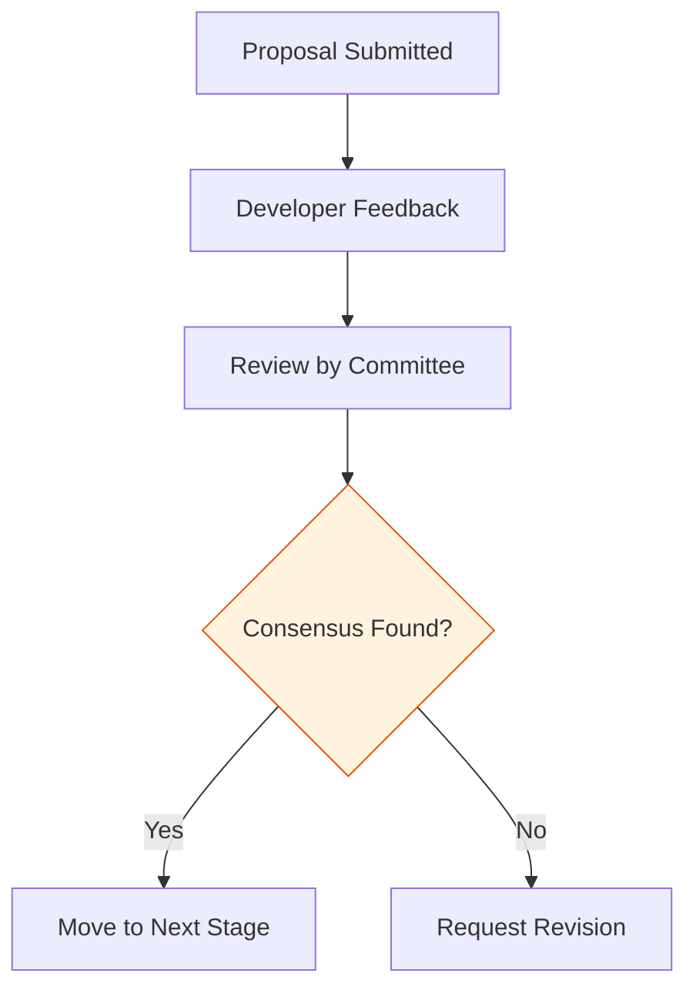

# BK-01: TC39 Governance

> **"Dewan Arsitek Hub. `TC39 Governance` membedah struktur komite yang bertanggung jawab atas evolusi JavaScript dan bagaimana konsensus dicapai."**

**Source Hub**: 
- [TC39: Participation](https://tc39.es/about/participation/)

---

## 1. Konsep & Esensi

**Definisi Arsitek**:
**TC39 (Technical Committee 39)** adalah bagian dari ECMA International yang bertugas menstandarisasi JavaScript. Ia bukan sirkuit tunggal, melainkan sebuah dewan yang terdiri dari implementer engine (V8, WebKit, dst), akademisi, dan perusahaan teknologi besar yang bekerja berdasarkan model **Konsensus**.

---

## 2. Visualisasi Sistem: Consensus Pipeline

---

## 3. Mekanisme & Hubungan

### Infrastruktur Tata Kelola
1. **Delegasi Resmi**: Setiap anggota (Member) mengirimkan delegasi teknis untuk berdiskusi dalam rapat rutin 2 bulanan.
2. **Model Konsensus**: Tidak ada voting mayoritas. Sebuah proposal hanya bisa maju jika *seluruh* delegasi setuju (atau setidaknya tidak ada yang keberatan secara fundamental).
3. **Open Stewardship**: Meskipun eksklusif, proses ini transparan. Seluruh catatan rapat (Notes) dipublikasikan di GitHub untuk diaudit oleh publik.

---

## 4. Arsitek Mindset
Evolusi Hub bersifat sangat lambat dan hati-hati. Ini dilakukan untuk menjaga komparibilitas sirkuit lama agar tetap bisa berjalan di mesin modern (Prinsip "Don't Break the Web").

---

## 5. Lab Praktis
Eksperimen di folder `examples/` membedah pilar utama:
1.  **[Governance Flow](./examples/01_governance_flow.js)**: Simulasi pengambilan keputusan berdasarkan konsensus delegasi.

---
*Buku Status: [status.md](../../status.md)*
