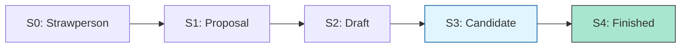

# BK-02: Spec Lifecycle (Stages 0-4)

> **"Alur Kelahiran Fitur. `Spec Lifecycle` membedah 5 tahap (Stages) yang harus dilalui setiap ide sebelum menjadi sirkuit resmi di Hub."**

**Source Hub**: 
- [TC39: Process](https://tc39.github.io/process-document/)

---

## 1. Konsep & Esensi

**Definisi Arsitek**:
Sebuah fitur baru tidak langsung dipasang di Hub. Ia harus membuktikan kematangannya melalui **5 Pintu Gerbang (Stages)**. Tahap ini memastikan fitur tersebut memiliki desain teknis yang solid, dukungan implementasi engine, dan tes verifikasi yang lengkap.

---

## 2. Visualisasi Sistem: Stage Progress Gate

---

## 3. Mekanisme & Hubungan

### Rincian Gerbang (Stage Logic)
| Stage | Nama | Persyaratan Utama | Status Implementasi |
| :--- | :--- | :--- | :--- |
| **Stage 1** | Proposal | Memiliki champion & gambaran solusi. | Eksperimental. |
| **Stage 2** | Draft | Teks spesifikasi format ECMA-262 awal. | Polyfill/Transpiler. |
| **Stage 3** | Candidate | Spesifikasi selesai & direview. | Implementasi Engine dimulai. |
| **Stage 4** | Finished | 2 implementasi engine lulus Test262. | Standar Resmi Hub. |

---

## 4. Arsitek Mindset
Gunakan fitur **Stage 4** untuk sirkuit produksi. Gunakan fitur **Stage 3** jika Anda siap menghadapi perubahan kecil. Hindari fitur di bawah **Stage 2** untuk proyek jangka panjang karena sirkuit tersebut masih sangat mungkin dibongkar pasang.

---

## 5. Lab Praktis
Eksperimen di folder `examples/` membedah pilar utama:
1.  **[Stage Verification](./examples/01_stage_verification.js)**: Simulasi pengecekan kematangan fitur sebelum integrasi ke sirkuit utama.

---
*Buku Status: [status.md](../../status.md)*
