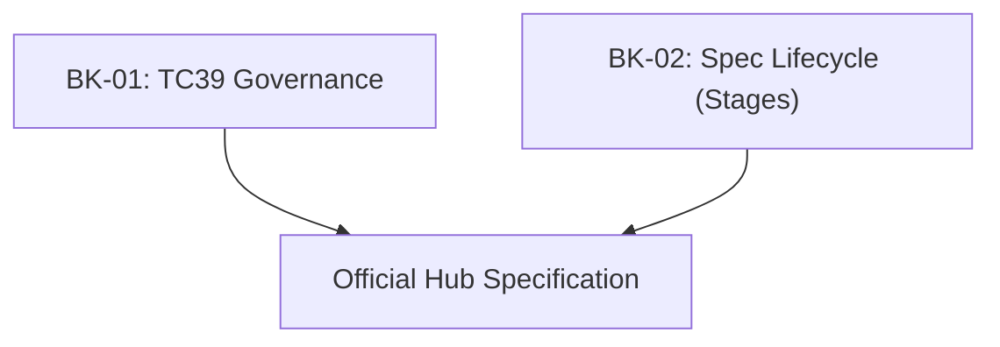

# SR-01: Evolution Ecosystem (The Stewardship)

> **"Mekanisme Kemajuan Hub. `SR-01` membedah bagaimana standar bermanuver, siapa yang memegang kendali, dan bagaimana sebuah ide bertransformasi menjadi spesifikasi resmi."**

**Source Hub**: 
- [TC39: About](https://tc39.es/about/)
- [ECMA-262: Introduction](https://tc39.es/ecma262/#sec-introduction)

---

## 🏗️ The Stewardship Pillars

---

## Koleksi Buku:
1.  **[BK-01: TC39 Governance](./BK-01_Governance/)**: Struktur komite, keanggotaan, dan konsensus.
2.  **[BK-02: Spec Lifecycle](./BK-02_SpecLifecycle/)**: Detil teknis persyaratan masuk ke Stage 0 hingga 4.

---
*Back to [RAK-03](../README.md)*
