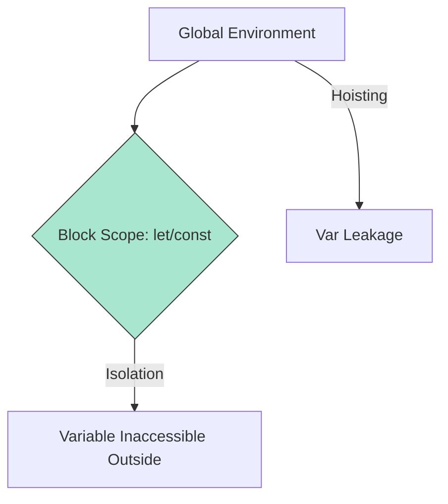

# BK-01: Structural & Lexical Reinforcement

> **"Penguatan Kerangka Hub. `Structural & Lexical Reinforcement` membedah transisi dari pola lama (Var/Prototype) menuju arsitektur modern yang lebih aman dan terstruktur."**

**Source Hub**: 
- [ECMA-262: Class Definitions](https://tc39.es/ecma262/#sec-class-definitions)
- [ECMA-262: Block-Level Scoping](https://tc39.es/ecma262/#sec-let-and-const-declarations)

---

## 1. Konsep & Esensi

**Definisi Arsitek**:
ES2015 memperkenalkan **Lexical Scoping** yang ketat melalui `let` dan `const`, serta **Class Sugar** yang menstandarisasi pembuatan objek. Ini bukan sekadar penambahan fitur, tapi perbaikan sirkuit agar tidak terjadi kebocoran variabel (Hoisting) yang tidak terprediksi.

---

## 2. Visualisasi Sistem: Lexical vs Global Scope

---

## 3. Mekanisme & Hubungan

### Infrastruktur Struktural
1. **Lexical Declarations**: `let` dan `const` menciptakan Environment Record baru yang terbatas pada blok `{}`. Hal ini mencegah tabrakan sirkuit antar modul.
2. **Class Mechanics**: Meskipun terlihat seperti OOP tradisional, di balik layar Hub tetap menggunakan **Internal Method [[GetPrototypeOf]]** (Prototype Chain). Class hanyalah notasi yang lebih bersih untuk arsitek.
3. **Module System**: Menstandarisasi transmisi energi antar file tanpa mengandalkan variabel global, menjaga integritas sirkuit tetap tertutup (Encapsulated).

---

## 4. Arsitek Mindset
Gunakan `const` sebagai default untuk setiap binding data. Gunakan `let` hanya jika sirkuit butuh mutasi energi. Hindari `var` karena ia memiliki perilaku "bocor" (Global Pollution) yang melanggar etika arsitektur modern.

---

## 5. Lab Praktis
Eksperimen di folder `examples/` membedah pilar utama:
1.  **[Lexical Isolation](./examples/01_lexical_isolation.js)**: Demonstrasi perbedaan antara kebocoran `var` vs isolasi ketat `let/const`.
2.  **[Class Anatomy](./examples/02_class_anatomy.js)**: Membedah kaitan antara sintaks Class modern dengan mekanisme prototipe di bawahnya (RAK-04).

---
*Buku Status: [status.md](../../status.md)*
