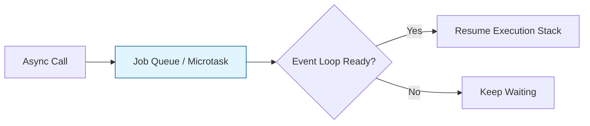

# BK-02: Control Flow & Async Evolution

> **"Aliran Energi Tak Terputus. `Control Flow & Async Evolution` membedah transformasi penanganan tugas asinkron di Hub, dari Callback Hell menuju aliran yang elegan dan deterministik."**

**Source Hub**: 
- [ECMA-262: Promise Objects](https://tc39.es/ecma262/#sec-promise-objects)
- [ECMA-262: Async Functions](https://tc39.es/ecma262/#sec-async-function-definitions)

---

## 1. Konsep & Esensi

**Definisi Arsitek**:
JavaScript bersifat single-threaded. **Promises** dan **Async/Await** adalah mekanisme Hub untuk mengatur antrean energi (Job Queue) agar tugas berat (I/O) tidak memblokir sirkuit utama (Main Thread). Hal ini memungkinkan Hub tetap responsif saat menunggu transmisi data eksternal.

---

## 2. Visualisasi Sistem: Async Pipeline

---

## 3. Mekanisme & Hubungan

### Infrastruktur Asinkron
1. **Promise Internals**: Sebuah Promise memiliki slot internal **[[PromiseState]]** (pending, fulfilled, rejected). Status ini hanya bisa berubah satu kali, menjamin determinisme sirkuit.
2. **Async/Await Magic**: Ini adalah "Syntax Sugar" di atas Generator dan Promise. Ia membungkus alur asinkron ke dalam struktur yang terlihat sinkron agar lebih mudah diaudit oleh arsitek.
3. **Top-level Await**: Memungkinkan modul untuk menunggu inisialisasi energi sebelum mengekspor komponennya, menjamin kesiapan sirkuit sebelum digunakan modul lain.

---

## 4. Arsitek Mindset
Rancanglah aliran asinkron Anda selayaknya sirkuit paralel. Gunakan `Promise.all` untuk memproses energi secara bersamaan, dan gunakan `async/await` untuk menjaga keterbacaan alur logika bisnis Anda.

---

## 5. Lab Praktis
Eksperimen di folder `examples/` membedah pilar utama:
1.  **[Promise Identity](./examples/01_promise_identity.js)**: Membedah slot internal Promise dan perilaku Microtask Queue.
2.  **[Async Flow Sync](./examples/02_async_flow_sync.js)**: Demonstrasi bagaimana `await` menjinakkan tugas asinkron ke dalam aliran sekuensial.

---
*Buku Status: [status.md](../../status.md)*
