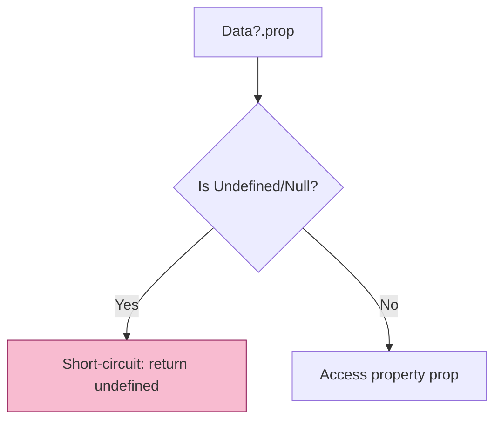

# BK-03: Data Resilience & Safety

> **"Ketahanan Sirkuit Data. `Data Resilience & Safety` membedah fitur-fitur yang dirancang untuk menangani kegagalan transmisi data dan presisi tinggi tanpa memutus aliran aplikasi."**

**Source Hub**: 
- [ECMA-262: Optional Chaining](https://tc39.es/ecma262/#sec-optional-chaining-operator)
- [ECMA-262: BigInt Objects](https://tc39.es/ecma262/#sec-bigint-objects)

---

## 1. Konsep & Esensi

**Definisi Arsitek**:
Aplikasi modern sering berurusan dengan data eksternal yang tidak menentu. **Optional Chaining (`?.`)** dan **Nullish Coalescing (`??`)** adalah katup pengaman (Safety Valves) yang mencegah `TypeError` saat mengakses properti yang tidak ada. Sementara itu, **BigInt** memungkinkan Hub menangani angka yang lebih besar dari batas aman 64-bit (IEEE 754).

---

## 2. Visualisasi Sistem: Short-Circuiting Flow

---

## 3. Mekanisme & Hubungan

### Infrastruktur Ketahanan
1. **Optional Chaining Mechanism**: Secara internal di RAK-04, operator `?.` mengubah alur *Reference Resolution*. Jika base dari referensi bernilai nullish, ia tidak memanggil metode internal `[[Get]]`, melainkan langsung mengembalikan `undefined`.
2. **Nullish Coalescing vs OR**: `??` hanya bereaksi pada `null` dan `undefined`. Ini lebih aman daripada `||` yang juga bereaksi pada angka `0` atau string kosong `""`, yang seringkali merupakan data valid di Hub.
3. **BigInt Isolation**: BigInt hidup di sirkuit presisi yang berbeda. Ia tidak bisa dicampur (mixed-math) dengan Number biasa tanpa konversi eksplisit, mencegah kehilangan presisi yang tidak disengaja.

---

## 4. Arsitek Mindset
Gunakan `?.` untuk navigasi data yang tidak pasti strukturnya. Gunakan `??` sebagai default value yang presisi. Gunakan **BigInt** hanya jika Anda berurusan dengan ID atau koordinat kriptografis yang melampaui 53-bit mantissa.

---

## 5. Lab Praktis
Eksperimen di folder `examples/` membedah pilar utama:
1.  **[Safety Chaining](./examples/01_safety_chaining.js)**: Demonstrasi ketahanan aplikasi terhadap data nullish menggunakan `?.` dan `??`.
2.  **[BigInt Integrity](./examples/02_bigint_integrity.js)**: Membuktikan presisi BigInt pada angka raksasa yang gagal ditangani oleh Number biasa.

---
*Buku Status: [status.md](../../status.md)*
