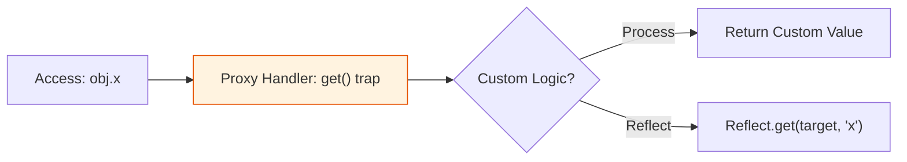

# BK-04: Metaprogramming & Reflection

> **"Kesadaran Diri Hub. `Metaprogramming & Reflection` membedah kemampuan JavaScript untuk memeriksa, memanipulasi, dan menginterupsi perilakunya sendiri secara dinamis."**

**Source Hub**: 
- [ECMA-262: Proxy Objects](https://tc39.es/ecma262/#sec-proxy-objects)
- [ECMA-262: The Reflect Object](https://tc39.es/reflect-object)

---

## 1. Konsep & Esensi

**Definisi Arsitek**:
Metaprogramming adalah menulis kode yang memanipulasi kode lain. **Proxy** bertindak sebagai perisai (Intercepter) yang bisa menangkap metode internal objek Anda. **Reflect** adalah sekumpulan alat (Toolkit) yang memungkinkan Anda memanggil metode internal tersebut secara fungsional.

---

## 2. Visualisasi Sistem: Proxy Interception Layer

---

## 3. Mekanisme & Hubungan

### Infrastruktur Refleksi
1. **Proxy Traps**: Hub menyediakan trap untuk hampir seluruh metode internal (RAK-04), seperti `get`, `set`, `has`, dan `apply`. Hal ini memungkinkan pembuatan objek "cerdas" yang bisa divalidasi secara real-time.
2. **Reflect API**: Setiap metode di objek `Reflect` memiliki nama dan argumen yang sama dengan internal methods. Ia adalah cara elegan untuk melakukan operasi default di dalam sebuah Proxy Trap.
3. **Symbols & Metadata**: Symbol memberikan identitas unik pada properti agar tidak terjadi tabrakan pada sirkuit metaprogramming yang kompleks.

---

## 4. Arsitek Mindset
Gunakan **Proxy** untuk membangun abstraksi tingkat tinggi seperti *Reactivity Systems* (seperti di Vue 3) atau *Schema Validation*. Hindari penggunaan berlebih pada sirkuit kritis performa karena setiap interupsi Proxy memiliki biaya komputasi.

---

## 5. Lab Praktis
Eksperimen di folder `examples/` membedah pilar utama:
1.  **[Proxy Interceptor](./examples/01_proxy_interceptor.js)**: Menggunakan trap `get` dan `set` untuk membuat objek yang memiliki validasi otomatis.
2.  **[Reflect Toolkit](./examples/02_reflect_toolkit.js)**: Menggunakan `Reflect` untuk memanipulasi objek secara lebih bersih dan terprediksi daripada operator tradisional.

---
*Buku Status: [status.md](../../status.md)*
