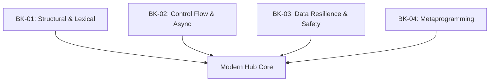

# SR-02: Modern Core Evolution (ES2015 - ES2024)

> **"Mutasi Genetik Hub. `SR-02` membedah fitur-fitur modern yang mengubah cara sirkuit JavaScript dibangun, dari penguatan leksikal hingga pemrosesan asinkron tak terbatas."**

**Source Hub**: 
- [ECMA-262: History and ESNext](https://tc39.es/ecma262/#sec-history)

---

## 🏗️ The 4 Modern Pillars

---

## Koleksi Buku:
1.  **[BK-01: Structural & Lexical](./BK-01_StructuralLexical/)**: Class, Modules, Arrow Functions, dan Lexical Scoping.
2.  **[BK-02: Control Flow & Async](./BK-02_ControlFlowAsync/)**: Promises, Async/Await, dan Top-level Await.
3.  **[BK-03: Data Resilience & Safety](./BK-03_DataResilience/)**: Optional Chaining, Nullish Coalescing, BigInt.
4.  **[BK-04: Metaprogramming & Reflection](./BK-04_Metaprogramming/)**: Proxy, Reflect, Symbols.

---
*Back to [RAK-03](../README.md)*
