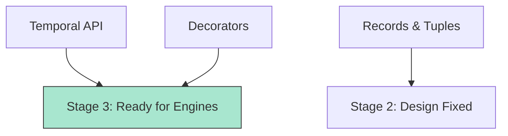

# BK-01: Active Proposals Track

> **"Garis Depan Inovasi. `Active Proposals Track` membedah fitur-fitur pilihan yang akan segera mengubah wajah Hub, dari penanganan waktu hingga metadata kelas."**

**Source Hub**: 
- [TC39: Proposals Table](https://github.com/tc39/proposals/blob/main/README.md)

---

## 1. Konsep & Esensi

**Definisi Arsitek**:
Masa depan Hub tidak ditentukan secara sembunyi-sembunyi. Melalui daftar **Active Proposals**, kita bisa melihat fitur apa yang sedang diuji. Arsitek harus memiliki "Radar" terhadap fitur ini agar bisa mengantisipasi perubahan paradigma sirkuit di masa depan.

---

## 2. Visualisasi Sistem: Feature Watchlist

---

## 3. Mekanisme & Hubungan

### Fitur Pilihan (Current Watchlist)
1. **Temporal (Stage 3)**: Pengganti objek `Date` yang rusak. Ia membawa presisi waktu absolut ke dalam Hub.
2. **Decorators (Stage 3)**: Standarisasi cara menambahkan metadata ke class dan member-nya, sangat krusial bagi ekosistem framework modern.
3. **Records & Tuples (Stage 2)**: Membawa tipe data primitif yang bersifat "Immutable-by-default" ke dalam Hub, mengubah cara kita mengelola status aplikasi.

---

## 4. Arsitek Mindset
Jangan terburu-buru menggunakan fitur Stage 2 ke bawah untuk sistem inti (Core). Fokuslah pada **Stage 3** (Candidate) untuk eksperimentasi serius, karena pada tahap ini desain teknis biasanya sudah 95% stabil.

---

## 5. Lab Praktis
Eksperimen di folder `examples/` membedah pilar utama:
1.  **[Future Sneak Peek](./examples/01_future_sneak_peek.js)**: Simulasi penggunaan fitur masa depan (menggunakan polyfill atau konsep simulasi).

---
*Buku Status: [status.md](../../status.md)*
