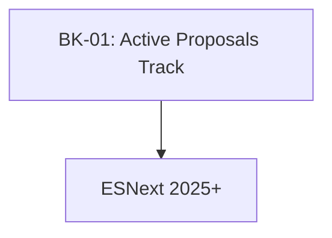

# SR-03: Future Hub / Proposals

> **"Radar Masa Depan Hub. `SR-03` memantau fitur-fitur yang masih berada di dalam laboratorium TC39, memberikan wawasan arsitektural sebelum mereka menjadi standar resmi."**

**Source Hub**: 
- [TC39: Active Proposals](https://github.com/tc39/proposals)

---

## 🏗️ The Future Pillar

---

## Koleksi Buku:
1.  **[BK-01: Active Proposals](./BK-01_ActiveProposals/)**: Daftar fitur pilihan yang sedang dipantau (Stage 1-4).

---
*Back to [RAK-03](../README.md)*
