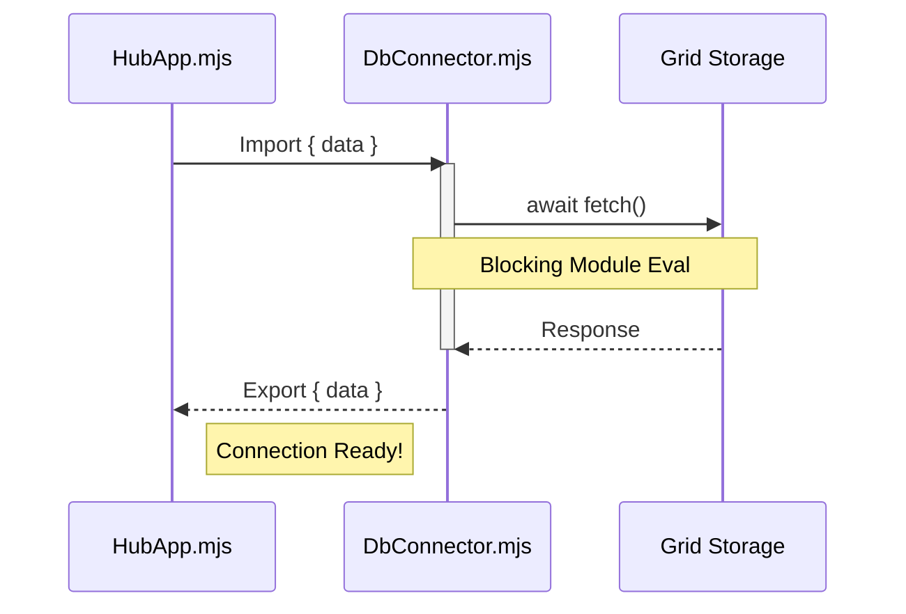

# CH-01: Top-Level Await (Instant Initialization)

> **"Dulu, Hub harus membungkus setiap modul asinkron dalam fungsi 'async' hanya untuk memulai. Sekarang, dengan Top-Level Await, sistem dapat melakukan 'Inisialisasi Instan' (Instant Initialization) langsung di level teratas modul, menyederhanakan docking antar unit."**

**Source Hub**: 
- [MDN: top-level await](https://developer.mozilla.org/en-US/docs/Web/JavaScript/Reference/Operators/await#top_level_await)
- [V8: Top-level await](https://v8.dev/features/top-level-await)
- [ECMA-262: Module Execution](https://tc39.es/ecma262/#sec-moduleevaluation)

---

## 1. Konsep & Esensi

**Definisi Arsitek**:
ES2022 memungkinkan penggunaan kata kunci `await` di luar fungsi `async` pada level teratas sebuah modul. Ini mengubah modul menjadi unit asinkron yang memblokir eksekusi modul yang mengimpornya sampai janji (*promise*) terpenuhi, menjamin ketersediaan sumber daya sebelum kode konsumen berjalan.

**Model Model**:
- **Dulu**: Anda harus membuat fungsi pembungkus seperti `async function init() { ... }` dan memanggilnya. Ini sering menyebabkan masalah urutan pemuatan (*race condition*).
- **Sekarang**: Modul tersebut bisa langsung memanggil `await fetchConfig()`. Modul lain yang melakukan `import` akan menunggu secara otomatis sampai konfigurasi tersebut selesai dimuat sebelum melanjutkannya.

---

## 2. Visualisasi Sistem: Dependency Blocking

---

## 3. Mekanisme & Hubungan

### Manfaat Operasional
- **Resource Loading**: Memuat model AI atau dataset besar sebelum mengekspor fungsi.
- **Dependency Awareness**: Menjamin urutan eksekusi yang benar antar modul asinkron tanpa *boilerplate* `init()`.

### Arsitek Mindset: Startup yang Terkendali
- Gunakan Top-Level Await untuk inisialisasi yang *memang harus* selesai sebelum Hub mulai melayani permintaan.
- **Hati-hati**: Operasi yang menggantung (hang) pada top-level await akan memblokir seluruh pohon dependensi aplikasi. Gunakan `Promise.race` dengan timeout jika diperlukan.
- Syarat: Hanya berlaku pada **ES Modules** (`.mjs` atau `type: module`).

---

## 4. Lab Praktis
Buka folder `examples/top_level_await_lab.js` untuk melihat bagaimana Top-Level Await mempermudah integrasi data asinkron antar unit Hub tanpa race condition.

---
*Status: [status.md](../../../../../status.md)*
