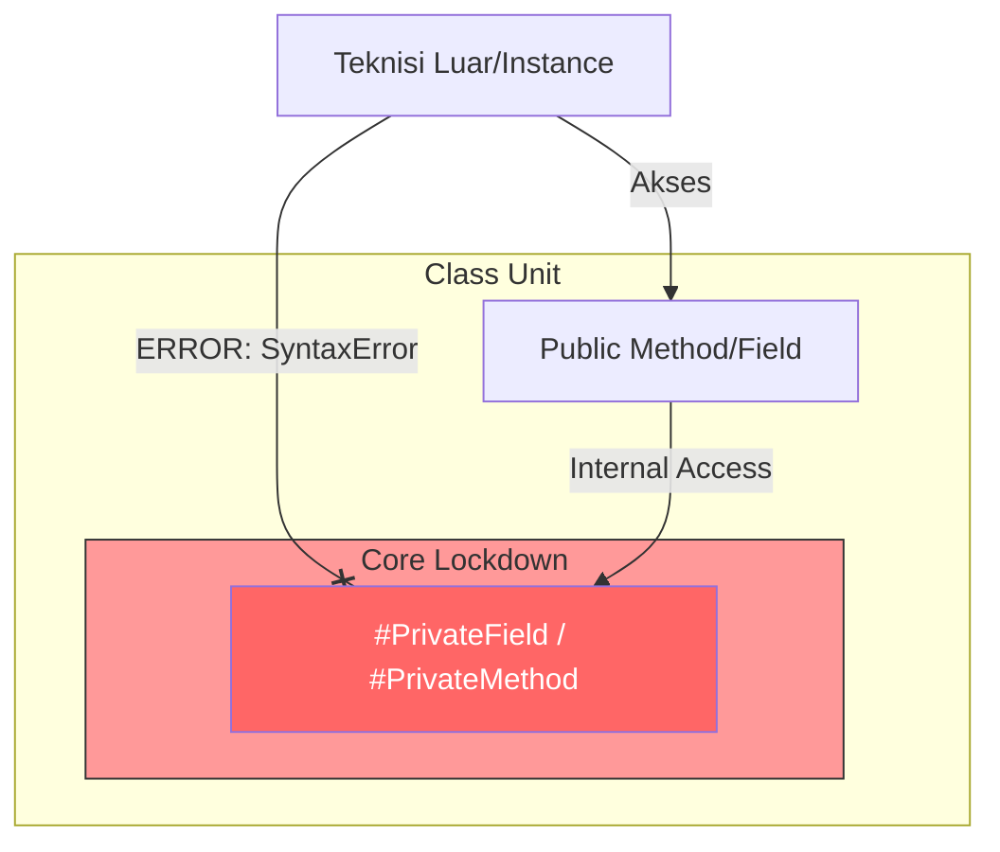

# CH-02: Class Reinforcement (Private & Static Blocks)

> **"Tidak semua komponen di Hub boleh disentuh sembarang orang. Class Reinforcement adalah 'Lockdown Inti' (Core Lockdown) yang menyembunyikan mekanisme internal Hub di balik dinding baja yang tidak bisa ditembus oleh Grid luar."**

**Source Hub**: 
- [MDN: Private class fields](https://developer.mozilla.org/en-US/docs/Web/JavaScript/Reference/Classes/Private_class_fields)
- [MDN: Static initialization blocks](https://developer.mozilla.org/en-US/docs/Web/JavaScript/Reference/Classes/Static_initialization_blocks)
- [ECMA-262: Class Definitions](https://tc39.es/ecma262/#sec-class-definitions)

---

## 1. Konsep & Esensi

**Definisi Arsitek**:
ES2022 menyempurnakan enkapsulasi kelas dengan memperkenalkan **Private Fields** (`#`) dan **Static Initialization Blocks**. Private fields menjamin privasi data di level bahasa (hard-private), bukan sekadar konvensi (`_`), sementara static blocks memungkinkan inisialisasi logika statis yang kompleks di dalam lingkup kelas.

**Model Mental**:
Bayangkan sebuah reaktor nuklir di dalam Hub:
- **Public**: Lampu-lampu panel yang bisa dilihat semua orang.
- **Private (`#`)**: Inti reaktor yang hanya bisa diakses oleh sistem internal reaktor tersebut.
- **Static Blocks**: Sistem pengaturan awal reaktor yang berjalan otomatis tepat saat reaktor selesai dibangun, bahkan sebelum instance pertama diciptakan.

---

## 2. Visualisasi Sistem: Hard-Private Isolation



---

## 3. Mekanisme & Hubungan

### Private Fields & Methods (`#`)
Dandai dengan prefix `#`. Properti ini benar-benar tidak bisa diakses dari luar kelas, bahkan menggunakan `obj['#field']`.
```javascript
class Reactor {
    #coreTemperature = 5000;
    getTemp() { return this.#coreTemperature; } // Akses Valid
}
```

### Static Initialization Blocks
Blok kode yang berjalan satu kali saat kelas dimuat oleh engine. Berguna untuk inisialisasi yang membutuhkan `try-catch` atau akses ke data luar.
```javascript
class Hub {
    static sectors;
    static {
        try {
            this.sectors = loadSectorsFromGrid();
        } catch {
            this.sectors = ["DEFAULT_ALPHA"];
        }
    }
}
```

---

## 4. Lab Praktis
Buka file `examples/core_lockdown_lab.js` untuk berlatih membangun reaktor yang aman dengan enkapsulasi total dan mencoba fitur `.at()` pada log sistem.

---
*Status: [status.md](../../../../../status.md)*
