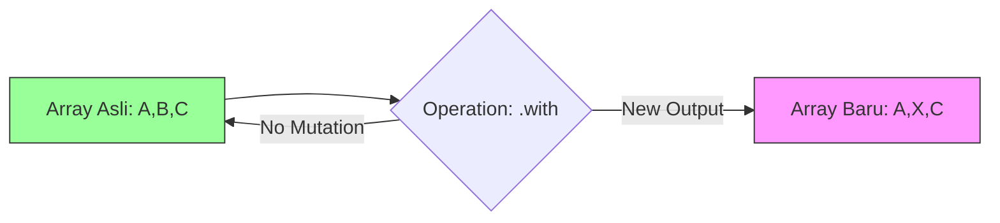

# CH-01: Change Array by Copy (Non-Destructive Sifting)

> **"Di dalam Hub yang sibuk, mengubah data asli bisa sangat berbahaya bagi unit lain yang sedang membacanya. Change Array by Copy adalah 'Saringan Non-Destruktif' (Non-Destructive Sifting) yang memungkinkan Anda memilah data dan mendapatkan hasil baru tanpa merusak susunan data asli di Grid."**

**Source Hub**: 
- [MDN: Array.prototype.toSorted](https://developer.mozilla.org/en-US/docs/Web/JavaScript/Reference/Global_Objects/Array/toSorted)
- [MDN: Array.prototype.with](https://developer.mozilla.org/en-US/docs/Web/JavaScript/Reference/Global_Objects/Array/with)
- [ECMA-262: Array.prototype.toSorted](https://tc39.es/ecma262/#sec-array.prototype.tosorted)

---

## 1. Konsep & Esensi

**Definisi Arsitek**:
ES2023 memperkenalkan serangkaian metode prototipe Array yang mengembalikan salinan baru alih-alih melakukan modifikasi di tempat (*in-place mutation*). Ini murni mendukung paradigma pemrograman fungsional dan manajemen state imutabel di dalam Hub.

**Model Mental**:
- **Metode Lama (`sort`, `reverse`, `splice`)**: Seperti mengubah susunan kabel di panel pusat secara langsung.
- **Metode Baru (`toSorted`, `toReversed`, `toSpliced`, `with`)**: Seperti memotret panel tersebut, lalu mengatur ulang susunan kabel di dalam foto (salinan). Panel aslinya tetap aman.

---

## 2. Visualisasi Sistem: Non-Destructive Flow

---

## 3. Mekanisme & Hubungan

### Senjata Baru di Grid
1.  **`.toSorted()`**: Mengembalikan array yang terurut.
2.  **`.toReversed()`**: Mengembalikan array dengan urutan terbalik.
3.  **`.toSpliced(start, deleteCount, ...items)`**: Mengembalikan array dengan bagian yang telah dipotog/ditambah.
4.  **`.with(index, value)`**: Mengembalikan array baru dengan satu elemen yang diubah.

### Arsitek Mindset: Integritas Data
- Gunakan metode `to...` saat bekerja dengan state Redux/React untuk menghindari bug mutasi yang sulit dilacak.
- Gunakan `.with()` untuk pembaruan satu titik data yang elegan tanpa *spread operator* `[...]`.

---

## 4. Lab Praktis
Buka file `examples/non_destructive_lab.js` untuk membandingkan bahaya metode lama dengan keamanan metode `toSorted` dan `with` dalam skenario Grid yang sibuk.

---
*Status: [status.md](../../../../../status.md)*
