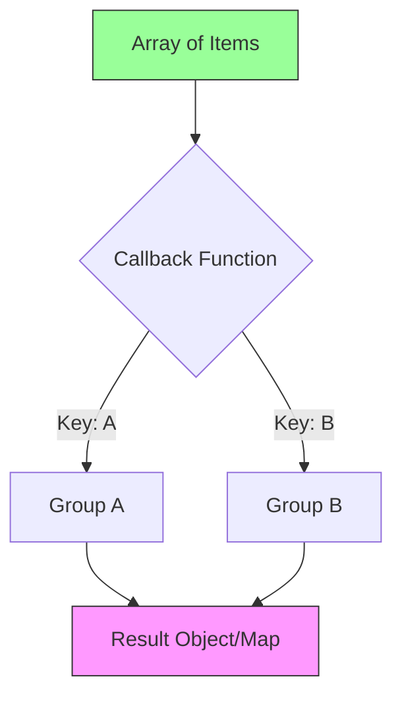

# CH-02: Object Grouping (Energy Classification)

> **"Data yang berceceran di Grid sulit dianalisis. Object Grouping adalah 'Pengklasifikasi Energi' (Energy Classifier) yang secara otomatis mengumpulkan unit-unit data ke dalam boks kategori yang tepat tanpa perlu algoritma manual yang rumit."**

**Source Hub**: 
- [MDN: Object.groupBy()](https://developer.mozilla.org/en-US/docs/Web/JavaScript/Reference/Global_Objects/Object/groupBy)
- [MDN: Map.groupBy()](https://developer.mozilla.org/en-US/docs/Web/JavaScript/Reference/Global_Objects/Map/groupBy)
- [ECMA-262: Object.groupBy](https://tc39.es/ecma262/#sec-object.groupby)

---

## 1. Konsep & Esensi

**Definisi Arsitek**:
ES2024 memperkenalkan `Object.groupBy()` dan `Map.groupBy()` sebagai metode statis untuk melakukan pengelompokan elemen koleksi (iterable) berdasarkan kriteria yang ditentukan dalam fungsi callback. Ini meniadakan kebutuhan akan logika `reduce` atau `forEach` manual untuk tugas pengelompokan yang umum.

**Model Mental**:
Bayangkan tumpukan sensor dari berbagai sektor (Alpha, Beta).
- **Dulu**: Anda harus melakukan loop manual, mengecek kategori, dan mendorong data ke array yang tepat.
- **Sekarang**: Anda cukup mendaftarkan sensor dan mesin Classifier akan mengotomatisasi pengelompokan ke dalam boks kategori secara instan.

---

## 2. Visualisasi Sistem: Automated Classification



---

## 3. Mekanisme & Hubungan

### Object.groupBy() vs Map.groupBy()
- **Object.groupBy**: Mengembalikan objek `null-prototype` (bersih). Cocok untuk output yang akan dikonsumsi langsung oleh JSON atau UI.
- **Map.groupBy**: Mengembalikan sebuah `Map`. Penting jika kunci pengelompokan Anda adalah objek atau jika Anda butuh performa tinggi untuk akses data berulang.

```javascript
const drones = [
  { id: 1, type: "flying" },
  { id: 2, type: "crawling" }
];
const grouped = Object.groupBy(drones, (d) => d.type);
```

---

## 4. Lab Praktis
Buka file `examples/energy_grouping_lab.js` untuk mencoba pengelompokan inventaris Hub berdasarkan level urgensi secara otomatis menggunakan `Object.groupBy`.

---
*Status: [status.md](../../../../../status.md)*
