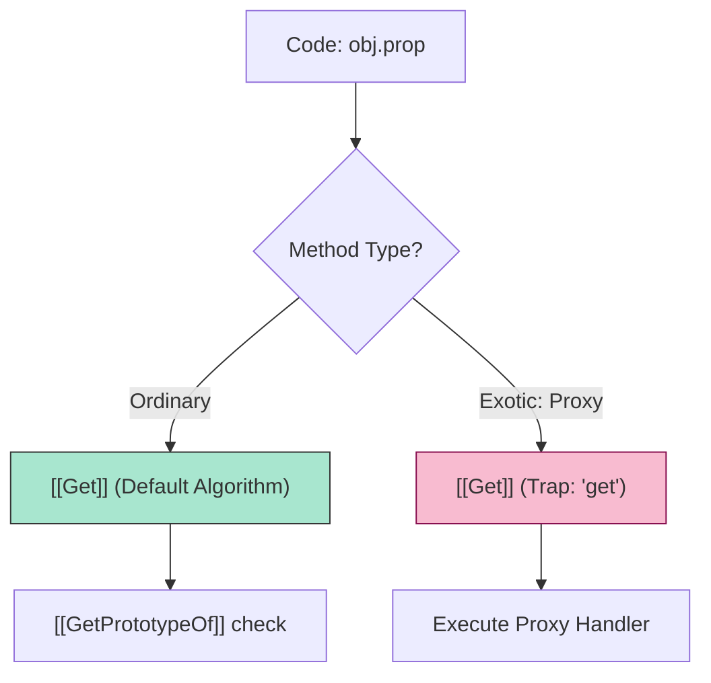

# CH-01: Objects and Prototypal Ethics

> **"Morfologi dan Etika Objek. `Objects and Prototypal Ethics` membedah struktur fundamental entitas di Hub dari perspektif metode internal dan delegasi prototipe."**

**Source Hub**: 
- [ECMA-262: Essential Internal Methods](https://tc39.es/ecma262/#sec-algorithm-conventions-internal-methods-and-slots)

---

## 1. Konsep & Esensi

**Definisi Arsitek**:
Sebuah **Object** di Hub didefinisikan secara eksklusif oleh **Essential Internal Methods**-nya. Jika sebuah objek menggunakan algoritma default (Base) untuk metode ini, ia adalah **Ordinary Object**. Jika ia menimpa (*override*) satu saja metode internal (misal: `[[Get]]` pada Proxy), ia diklasifikasikan sebagai **Exotic Object**.

---

## 2. Visualisasi Sistem: Internal Method Dispatch

---

## 3. Mekanisme & Hubungan

### Karakteristik Perilaku (Clause 6.1.7.2)
1. **Delegation Flow**: Saat `[[Get]]` gagal menemukan nilai di sirkuit lokal, ia secara otomatis memanggil `[[GetPrototypeOf]]` dan melanjutkan pencarian ke sirkuit delegasi (Prototype) sampai mencapai `null`.
2. **Exotic Mutants**: Objek seperti **Array** memiliki metode `[[DefineOwnProperty]]` yang eksotis untuk mensinkronisasi slot `length` dengan indeks elemen secara otomatis.
3. **Integritas Transmisi**: Protokol metode internal menjamin bahwa setiap interaksi objek di Hub bersifat deterministik, meskipun objek tersebut memiliki perilaku kustom (Proxy).

---

## 4. Arsitek Mindset
Rancanglah objek sebagai unit yang memiliki perilaku, bukan sekadar data. Gunakan delegasi prototipe untuk efisiensi memori, namun gunakan **Proxy** jika Anda butuh kontrol total (interupsi) terhadap aliran data internal objek Anda.

---

## 5. Lab Praktis
Eksperimen di folder `examples/` membedah dua pilar utama:
1.  **[Internal Method Dispatch](./examples/01_method_dispatch.js)**: Demonstrasi perbedaan antara ordinary objek dan interupsi Proxy.
2.  **[Delegation Flow](./examples/02_delegation_flow.js)**: Melacak alur pencarian nilai pada rantai prototipe secara rekursif.

---
*Status: [status.md](../../../../../status.md)*
