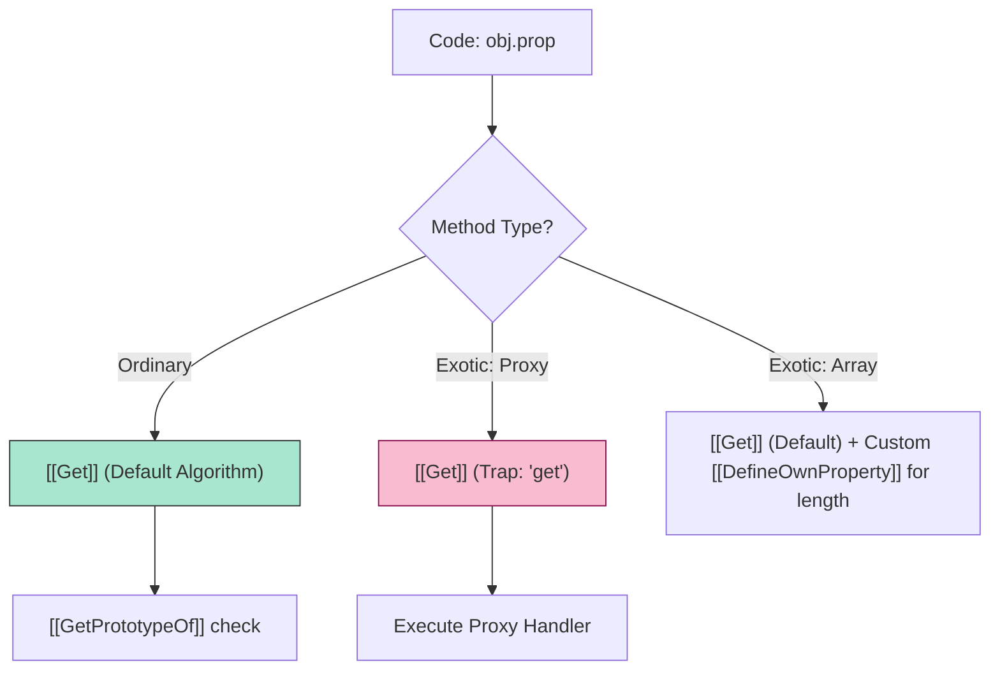

# CH-01: Objects and Prototypal Ethics

> **"Morfologi dan Etika Objek. `Objects and Prototypal Ethics` membedah struktur fundamental entitas di JavaScript dari perspektif metode internal dan delegasi prototipe."**

**Source Hub**: 
- [ECMA-262: Ordinary and Exotic Objects Behaviors](https://tc39.es/ecma262/#sec-ordinary-and-exotic-objects-behaviors)
- [ECMA-262: Essential Internal Methods](https://tc39.es/ecma262/#sec-algorithm-conventions-internal-methods-and-slots)

---

## 1. Konsep & Esensi

**Definisi Arsitek**:
Sebuah **Object** di Hub didefinisikan secara eksklusif oleh **Essential Internal Methods**-nya. Jika sebuah objek menggunakan algoritma default (Base) untuk metode ini, ia adalah **Ordinary Object**. Jika ia menimpa (*override*) satu saja metode internal (misal: `[[Get]]` pada Proxy), ia diklasifikasikan sebagai **Exotic Object**.

**Model Mental**:
- **Internal Methods**: Bahasa isyarat rahasia engine. Saat Anda mengetik `obj.x`, engine memanggil `obj.[[Get]]("x", obj)`.
- **Exotic Behavior**: Seperti sel mutan (e.g., Array) yang memiliki logika khusus pada metode `[[DefineOwnProperty]]` untuk menyinkronkan properti `length`.

---

## 2. Visualisasi Sistem: Internal Method Dispatch

---

## 3. Mekanisme & Hubungan

### Tabel Metode Internal Esensial (Clause 6.1.7.2)
| Internal Method | Penjelasan Teknis | Default Behavior (Ordinary) |
| :--- | :--- | :--- |
| `[[GetPrototypeOf]]` | Mengambil koneksi delegasi. | Mengembalikan nilai slot `[[Prototype]]`. |
| `[[Get]]` | Mengambil nilai properti. | Mencari di `self`, jika tidak ada, panggil `[[Get]]` pada Prototype. |
| `[[Set]]` | Menyimpan nilai properti. | Melakukan pengecekan `Writable` sebelum modifikasi. |
| `[[HasProperty]]` | Mengecek eksistensi. | Mengembalikan Boolean (termasuk hasil dari rantai Prototype). |

### Arsitek Mindset: Behavioral Consistency
- Saat membangun abstraksi tingkat tinggi, sadarilah bahwa **Exotic Objects** (seperti `Proxy`, `Bound Function`, atau `Array`) memiliki "biaya" performa karena menginterupsi alur transmisi standar engine. Gunakan prototipe delegasi daripada Proxy jika tujuannya hanya untuk berbagi logika (*logical sharing*).

---

## 4. Lab Praktis
Buka file `examples/internal_method_audit.js` untuk melihat bagaimana sebuah `Proxy` menginterupsi metode internal `[[Get]]` dan membandingkannya dengan perilaku `Ordinary Object`.

---
*Status: [status.md](../../../../../status.md)*
