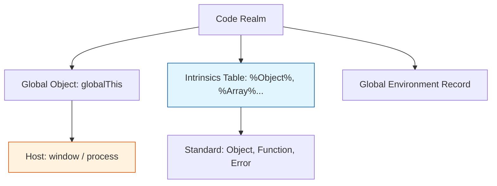
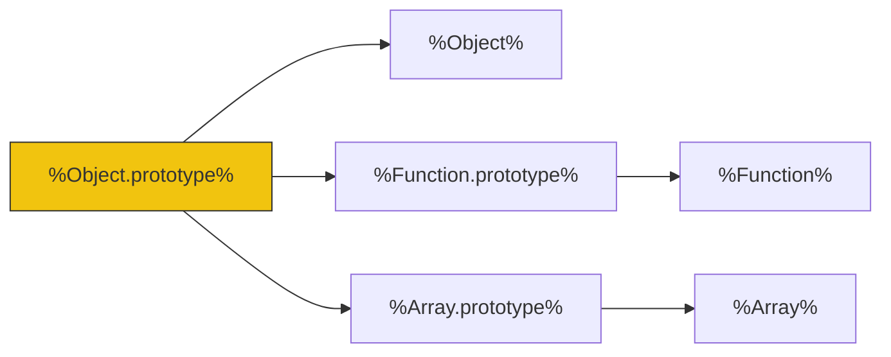

# CH-02: Standard and Built-in Structures

> **"Arsitektur Realm dan Intrinsics. `Standard and Built-in Structures` membedah bagaimana Hub menginisialisasi lingkungan eksekusi melalui objek-objek 'Sakti' yang sudah ada sebelumnya."**

**Source Hub**: 
- [ECMA-262: Realms](https://tc39.es/ecma262/#sec-code-realms)
- [ECMA-262: Well-Known Intrinsics](https://tc39.es/ecma262/#sec-well-known-intrinsics)

---

## 1. Konsep & Esensi

**Definisi Arsitek**:
Setiap kode JavaScript berjalan di dalam sebuah **Realm**. Sebuah Realm terdiri dari **Intrinsics**—kumpulan objek bawaan (seperti `%Object.prototype%` atau `%Array%`) yang diinisialisasi sebelum kode apapun dieksekusi. **Standard Objects** adalah subset yang harus hadir di setiap implementasi, sementara **Host Defined** (e.g. `window`) adalah ekstensi dari Realm tersebut.

**Model Mental**:
- **Realm**: Sebuah "Semesta" paralel. Jika Anda punya dua Iframe, Anda punya dua Realm dengan `%Object.prototype%` yang berbeda.
- **Intrinsics**: Akar dari pohon kehidupan Hub. Semua objek yang Anda buat pasti bercabang dari salah satu Intrinsic ini.

---

## 2. Visualisasi Sistem: Realm Anatomy

### Intrinsic Object Map

---

## 3. Mekanisme & Hubungan

### Komponen Infrastruktur (Clause 9.1 - 9.3)
1. **Well-Known Intrinsics**: Ditandai dengan tanda persen ganda (e.g., `%Map%`). Ini adalah referensi absolut yang digunakan spesifikasi untuk menjamin konsistensi sirkuit, terlepas dari apakah user telah menimpa variabel global.
2. **Realms & Agents**: Seorang **Agent** (seperti Thread) mengelola satu atau lebih Realm. Realm memisahkan "state" global antar modul atau window.
3. **Intrinsic Immutability**: Di level arsitektur tingkat tinggi, teknisi tidak boleh memodifikasi (monkey-patch) prototype dari intrinsic object karena akan merusak seluruh sirkuit di dalam Realm tersebut.

### Arsitek Mindset: Environment Isolation
- Pahami bahwa memodifikasi objek bawaan (seperti `Array.prototype.push`) bersifat destruktif secara global di dalam Realm tersebut. Jika Anda butuh fitur tambahan, gunakan **Utility Classes** atau **Composition** alih-alih merusak akar pohon intrinsik Hub.

---

## 4. Lab Praktis
Buka file `examples/realm_intrinsic_audit.js` untuk mendeteksi apakah sebuah objek berasal dari Realm yang sama atau berbeda (misal: membandingkan `instanceof` melintasi Iframe).

---
*Status: [status.md](../../../../../status.md)*
