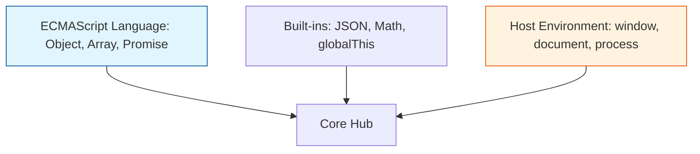

# CH-02: Standard and Built-in Structures

> **"Infrastruktur siap pakai di Hub. `Standard and Built-in Structures` membedah perbedaan antara alat yang disediakan bahasa dan pengaruh lingkungan luar (Host)."**

**Source Hub**: 
- [ECMA-262: Built-in Object](https://tc39.es/ecma262/#sec-built-in-object)

---

## 1. Konsep & Esensi

**Definisi Arsitek**:
**Standard Objects** adalah objek yang diwajibkan ada oleh spesifikasi ECMAScript (seperti `Object`, `Array`). **Built-in Objects** adalah objek yang sudah tersedia saat Hub dinyalakan. **Host Objects** adalah penambahan dari lingkungan luar (seperti `window` di Browser atau `fs` di Node.js) yang tidak diatur oleh ECMA-262 tapi bisa berinteraksi dengan sirkuit bahasa.

**Model Mental**:
Bayangkan Hub sebagai sebuah gedung kantor.
- **Standard**: Meja dan kursi (Wajib ada di setiap cabang Hub).
- **Built-in**: Lampu dan listrik yang sudah menyala saat Anda masuk.
- **Host**: Mesin kopi atau AC yang dipasang oleh pemilik gedung yang berbeda-beda.

---

## 2. Visualisasi Sistem: Object Environment Hierarchy

---

## 3. Mekanisme & Hubungan

### Karakteristik Infrastruktur (Clause 4.4.11 - 4.4.15)
1. **Standard Built-in Objects**: Objek yang memiliki identitas yang sama di setiap Agent Hub.
2. **The Host**: Bertindak sebagai penyedia energi (Execution Context) dan sumber daya eksternal. Hub tidak pernah mendefinisikan Host, ia hanya mendefinisikan bagaimana ia *berbicara* dengan Host.
3. **Well-known Intrinsics**: Objek-objek "Sakti" (seperti `%Object.prototype%`) yang menjadi akar dari seluruh sirkuit di Hub.

### Arsitek Mindset: Portability First
- Hindari ketergantungan yang terlalu dalam pada **Host Objects** jika Anda ingin sirkuit Anda bisa dipindahkan dengan mudah dari Browser ke Node.js atau sebaliknya. Selalu bungkus (wrap) akses ke Host di dalam modul isolasi khusus.

---

## 4. Lab Praktis
Buka file `examples/host_vs_standard_audit.js` untuk membedakan properti mana di Global Hub yang berasal dari standar ECMAScript dan mana yang disuntikkan oleh Host Anda.

---
*Status: [status.md](../../../../../status.md)*
