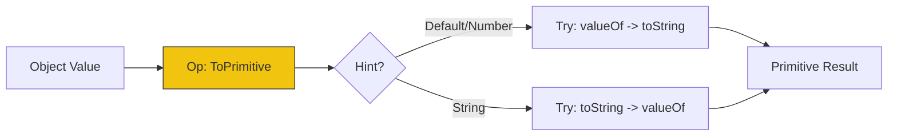

# CH-03: Data Type Taxonomies

> **"Taksonomi Tipe dan Operasi Abstrak. `Data Type Taxonomies` membedah klasifikasi data dari level nilai matematika hingga abstraksi bahasa yang digunakan oleh engine Hub."**

**Source Hub**: 
- [ECMA-262: Data Types and Values](https://tc39.es/ecma262/#sec-ecmascript-data-types-and-values)
- [ECMA-262: Relational Operators (ToPrimitive)](https://tc39.es/ecma262/#sec-toprimitive)

---

## 1. Konsep & Esensi

**Definisi Arsitek**:
Hub membedakan antara **Mathematical Value** (nilai ideal tak terbatas) dan **ECMAScript Language Types**. Setiap tipe bahasa memiliki algoritma konversi internal yang disebut **Abstract Operations** (seperti `ToNumber`, `ToString`, `ToBoolean`). Operasi yang paling krusial adalah **`ToPrimitive(input, preferredType)`**, yang mengubah objek menjadi nilai atomik.

**Model Mental**:
- **Language Types**: Topeng yang Anda lihat (String, Number).
- **Mathematical Value (MV)**: Kebenaran di balik topeng. Angka `10` di kode adalah representasi dari nilai matematika absolut 10.
- **ToPrimitive**: Mesin penghancur. Ia mencoba menghancurkan struktur kompleks (Object) menjadi elemen dasar (Primitive).

---

## 2. Visualisasi Sistem: Conversion Pipeline

---

## 3. Mekanisme & Hubungan

### Taksonomi Kedalaman (Clause 6.1)
1. **The Number Type (IEEE 754)**: Memahami bahwa `Number` bukan sekadar angka, tapi implementasi floating point 64-bit yang memiliki batas presisi dan nilai khusus (`+Infinity`, `-Infinity`, `NaN`).
2. **The BigInt Type**: Tipe data yang mewakili Mathematical Value secara integer dengan presisi tak terbatas (tidak bisa dicampur dengan Number).
3. **Specification Types (Clause 6.2)**: Tipe data internal seperti **Record**, **List**, **Completion**, dan **Reference**. Teknisi tidak bisa mengakses ini, tapi ini adalah mesin penggerak seluruh semantik bahasa.

### Arsitek Mindset: Type Integrity
- Hindari "Coercion" terselubung. Selalu gunakan konversi eksplisit (seperti `Number(val)`) daripada mengandalkan `ToPrimitive` otomatis (seperti `val + 0`). Konsistensi tipe data adalah kunci utama integritas sirkuit logika di Hub.

---

## 4. Lab Praktis
Buka file `examples/toprimitive_logic_lab.js` untuk melihat bagaimana Hub mengonversi objek kustom menjadi primitif melalui manipulasi metode `Symbol.toPrimitive`.

---
*Status: [status.md](../../../../../status.md)*
