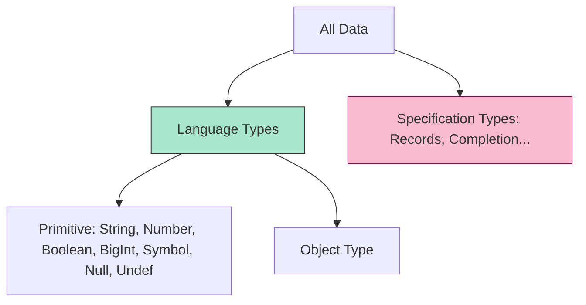

# CH-03: Data Type Taxonomies

> **"Klasifikasi energi dasar. `Data Type Taxonomies` adalah sistem kategorisasi Hub untuk membedakan antara muatan data mentah dan struktur data kompleks."**

**Source Hub**: 
- [ECMA-262: ECMAScript Data Types and Values](https://tc39.es/ecma262/#sec-ecmascript-data-types-and-values)

---

## 1. Konsep & Esensi

**Definisi Arsitek**:
Hub membagi seluruh data menjadi dua kategori besar: **Language Types** (data yang bisa diakses langsung oleh teknisi melalui kode) dan **Specification Types** (data internal yang hanya digunakan oleh Hub untuk melacak status dirinya sendiri). Language types dibagi lagi menjadi **Primitive Types** (data atomik) dan **Object Type** (kumpulan properti).

**Model Mental**:
- **Primitive**: Seperti atom tunggal (Emas, Perak). Jika Anda memotongnya, ia bukan lagi atom yang sama.
- **Object**: Seperti molekul (Air, Gula). Ia terdiri dari banyak atom dan memiliki struktur yang bisa diubah-ubah.

---

## 2. Visualisasi Sistem: Level of Abstraction

---

## 3. Mekanisme & Hubungan

### Taksonomi Inti (Clause 4.4.21 - 4.4.30)
1. **Primitive Value**: Nilai statis yang tidak memiliki identitas internal selain nilainya sendiri. Mereka disimpan langsung di dalam tumpukan energi (Stack).
2. **Object Value**: Struktur dinamis yang memiliki identitas unik. Dua objek dengan isi yang sama tetap dianggap dua entitas yang berbeda oleh Hub.
3. **Symbol (Clause 4.4.31)**: Kasus khusus—tipe primitif yang memiliki perilaku identitas unik layaknya objek, digunakan untuk kunci rahasia.

### Arsitek Mindset: Memory vs Value
- Pahami bahwa primitif dikirim melalui nilai (*Pass by Value*), sedangkan objek dikirim melalui referensi (*Pass by Reference*). Mengabaikan perbedaan ini akan menyebabkan kebocoran data (Side effects) yang berbahaya di dalam sirkuit logika besar.

---

## 4. Lab Praktis
Buka file `examples/primitive_vs_object_identity.js` untuk membuktikan mengapa `{}` tidak pernah sama dengan `{}` meskipun isinya identik.

---
*Status: [status.md](../../../../../status.md)*
