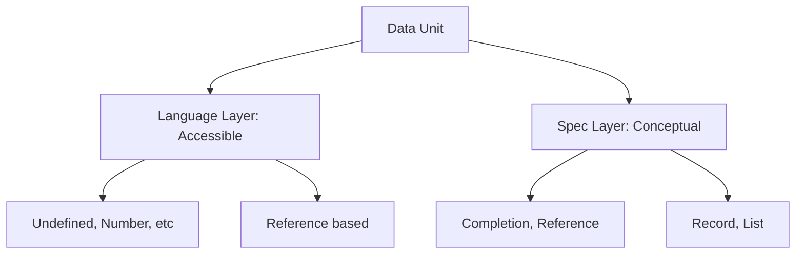

# CH-03: Type Taxonomy (Language vs Spec)

> **"Taksonomi Tipe Hub. `Type Taxonomy` membedah perbedaan antara nilai yang hidup di dalam kode Anda dan konsep abstrak yang hidup di dalam buku spesifikasi."**

**Source Hub**: 
- [ECMA-262: ECMAScript Data Types and Values](https://tc39.es/ecma262/#sec-ecmascript-data-types-and-values)

---

## 1. Konsep & Esensi

**Definisi Arsitek**:
Hub membagi dunia data menjadi dua lapisan:
1. **Language Types**: Nilai yang Anda gunakan langsung di kode (Undefined, Null, Boolean, String, Symbol, Number, BigInt, Object).
2. **Specification Types**: Abstraksi meta-data yang digunakan hanya oleh spesifikasi untuk mendeskripsikan logika internal (Record, List, Completion, Reference, dst).

---

## 2. Visualisasi Sistem: Type Stratification

---

## 3. Mekanisme & Hubungan

### Hierarki Data (Clause 6.1)
1. **Language Layer (Fuel)**: Lapisan ini adalah bahan bakar sirkuit Anda. Setiap tipe memiliki identitas dan aturan konversi (Abstract Operations) yang ketat.
2. **Spec Layer (Blueprint)**: Lapisan ini tidak pernah menyentuh memori runtime Anda secara langsung. Ia adalah alat bantu navigasi bagi implementer engine untuk membangun perilaku Hub yang konsisten.
3. **The Bridge**: Melalui operasi seperti `[[Get]]` atau `[[Set]]`, spesifikasi (Record/Reference) memanipulasi nilai di dunia nyata (Language Types).

---

## 4. Arsitek Mindset
Kuasailah **Language Types** untuk menulis kode yang efisien, namun pelajarilah **Specification Types** untuk memahami *mengapa* kode tersebut berjalan seperti itu. Pemahaman di level taksonomi ini memisahkan antara koder biasa dan arsitek bahasa.

---

## 5. Lab Praktis
Eksperimen di folder `examples/` membedah pilar utama:
1.  **[Taxonomy Audit](./examples/01_taxonomy_audit.js)**: Membedah perbedaan antara tipe data bahasa yang nyata vs simulasi tipe data spesifikasi.

---
*Status: [status.md](../../../../../status.md)*
