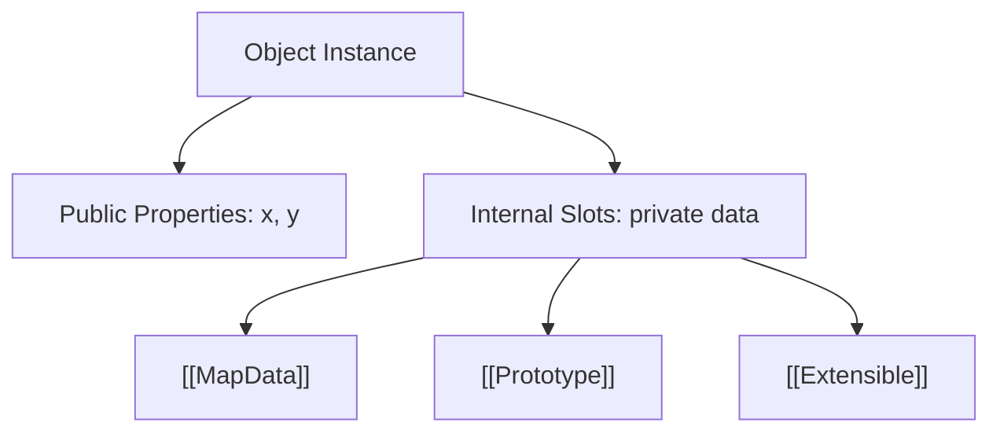

# CH-04: Internal Mechanics & Slots

> **"Sirkuit Tersembunyi. `Internal Mechanics & Slots` membedah penyimpanan status privat mesin yang menempel pada setiap objek di Hub."**

**Source Hub**: 
- [ECMA-262: Internal Methods and Slots](https://tc39.es/ecma262/#sec-algorithm-conventions-internal-methods-and-slots)

---

## 1. Konsep & Esensi

**Definisi Arsitek**:
**Internal Slots** (ditulis sebagai `[[SlotName]]`) adalah variabel privat milik engine yang menempel pada sebuah objek. Mereka tidak bisa diakses via string atau simbol, namun mereka menyimpan "jiwa" dari objek tersebut (misal: data internal sebuah Map atau status internal sebuah Promise).

---

## 2. Visualisasi Sistem: Object Anatomy

---

## 3. Mekanisme & Hubungan

### Infrastruktur Slot (Clause 6.1.7.3)
1. **Enkapsulasi Total**: Slot internal bersifat imun terhadap teknik refleksi apapun di level JS. Hal ini dilakukan demi keamanan sirkuit inti mesin.
2. **Incompatible Receivers**: Jika sebuah metode (misal: `Map.prototype.get`) mencoba mengakses slot `[[MapData]]` pada objek yang tidak memilikinya, Hub akan memutus sirkuit dengan melempar TypeError.
3. **Cross-Rack Linking**: Pemahaman slot internal di **SR-01** akan diperdalam di **RAK-06** (Engine Internals) saat kita membedah bagaimana V8 memetakan slot ini ke dalam *C++ Object Layout*.

---

## 4. Arsitek Mindset
Anggaplah objek di Hub seperti "Black Box". Anda berinteraksi dengan permukaan publiknya, namun performa dan perilakunya sangat bergantung pada apa yang tersimpan secara tersembunyi di dalam slot internalnya.

---

## 5. Lab Praktis
Eksperimen di folder `examples/` membedah pilar utama:
1.  **[Internal Slots Audit](./examples/01_internal_slots.js)**: Membuktikan keberadaan status tersembunyi dan bagaimana Hub memvalidasi identitas objek sebelum akses slot.

---
*Status: [status.md](../../../../../status.md)*
