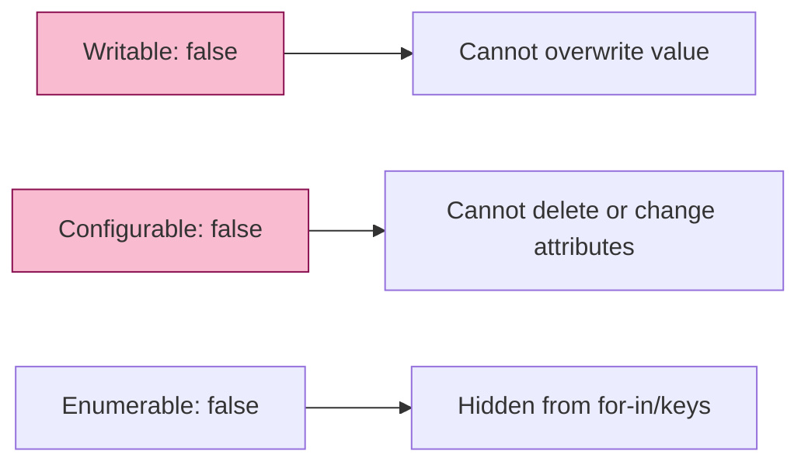

# CH-04: Properties and Internal Slots

> **"Anatomi Descriptor dan Internal Slots. `Properties and Internal Slots` membongkar mekanisme penyimpanan status di balik setiap objek Hub, dari atribut visibilitas hingga slot privat."**

**Source Hub**: 
- [ECMA-262: Property Attributes](https://tc39.es/ecma262/#sec-property-attributes)
- [ECMA-262: Object Internal Slots and Internal Methods](https://tc39.es/ecma262/#sec-object-internal-slots-and-internal-methods)

---

## 1. Konsep & Esensi

**Definisi Arsitek**:
Setiap properti didefinisikan oleh **Property Descriptor** (sebuah Record internal). Ada dua jenis: **Data Property** (menyimpan nilai) dan **Accessor Property** (fungsi get/set). Selain properti yang terlihat, objek memiliki **Internal Slots** (e.g., `[[Prototype]]`, `[[Extensible]]`) yang menyimpan status engine dan tidak bisa diiterasi.

**Model Mental**:
- **Data Descriptor**: Laci dengan kunci `writable`, `enumerable`, dan `configurable`.
- **Accessor Descriptor**: Tombol yang saat ditekan (get) atau diputar (set) memicu aksi eksternal.
- **Internal Slots**: Kabel-kabel internal di dalam mesin Hub yang menentukan apakah mesin bisa dimodifikasi atau tidak.

---

## 2. Visualisasi Sistem: Descriptor vs Internal Slots

```mermaid
graph TD
    Obj[Object Entity] --> Prop[Property List]
    Obj --> Slots[Internal Slots Table]
    
    Prop --> D[Data Descriptor: value, writable, ...]
    Prop --> A[Accessor Descriptor: get, set, ...]
    
    Slots --> P[[[Prototype]]]
    Slots --> E[[[Extensible]]]
    Slots --> Private[[[PrivateElements]]]
    
    style D fill:#e1f5fe,stroke:#01579b
    style Slots fill:#f8bbd0,stroke:#880e4f
```

### Property Attributes Impact


---

## 3. Mekanisme & Hubungan

### Detail Deskrpsi Properti (Clause 6.1.7.1)
- **`[[Writable]]`**: Jika `false`, metode internal `[[Set]]` akan gagal (baik secara diam-diam atau melempar Error di Strict Mode).
- **`[[Configurable]]`**: Jika `false`, tipe descriptor tidak bisa diubah dan properti tidak bisa dihapus. Ini adalah segel keamanan permanen.
- **`[[Enumerable]]`**: Menentukan visibilitas properti dalam iterasi `for-in` atau `Object.keys()`.

### Arsitek Mindset: State Encapsulation
- Manfaatkan **Internal Slots** (melalui **Private Fields** `#`) untuk enkapsulasi status yang benar-benar privat. Hindari konvensi underscore (`_private`) karena itu hanya "saran" sosial dan tidak memberikan perlindungan sirkuit di level engine Hub.

---

## 4. Lab Praktis
Buka file `examples/property_descriptor_lab.js` untuk mensimulasikan "pembekuan" objek menggunakan `Object.freeze()` dan melihat bagaimana ia mengubah seluruh atribut `configurable` dan `writable` menjadi `false`.

---
*Status: [status.md](../../../../../status.md)*
