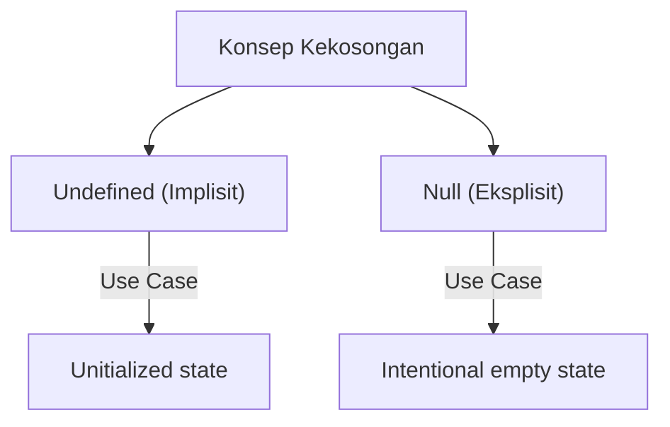

# CH-07: The Undefined & Null Types

> **"Memahami batas antara 'Belum Ada' dan 'Sengaja Ditiadakan' dalam leksikon spesifikasi."**

**Source Hub (Definitions)**: 
- [ECMA-262 Clause 4.4.13 - Undefined Value](https://tc39.es/ecma262/#sec-undefined-value)
- [ECMA-262 Clause 4.4.15 - Null Value](https://tc39.es/ecma262/#sec-null-value)

---

## 1. Konsep & Esensi (Terminology)

Penting bagi arsitek untuk membedakan kedua tipe ini dari sisi semantik spesifikasi:
- **Undefined Type (Clause 4.4.13)**: Digunakan secara otomatis oleh engine untuk variabel yang dideklarasikan tetapi belum diinisialisasi. Ini adalah tanda ketiadaan nilai secara implisit.
- **Null Type (Clause 4.4.15)**: Digunakan secara eksplisit sebagai penanda "Absence of any object value". Ini adalah sinyal desain yang menyatakan bahwa sebuah variabel memang kosong.

---

## 2. Visualisasi Perbandingan

---

## 3. Mekanisme & Penautan

Meskipun keduanya didefinisikan sebagai tipe data bahasa, mekanisme internal dan algoritma pengolahannya dibedah secara mendalam pada unit implementasi:

*   **Implementasi Teknis Undefined**: [SR-02/BK-01/CH-02](../../../SR-02-data-types-and-values/BK-01_LanguageCoreTypes/CH-02_UndefinedType/README.md)
*   **Implementasi Teknis Null**: [SR-02/BK-01/CH-03](../../../SR-02-data-types-and-values/BK-01_LanguageCoreTypes/CH-03_NullType/README.md)

---

## 4. Lab Praktis
Unit ini tidak membutuhkan Lab Praktis kode karena bersifat penjelasan terminologi. Eksperimen fungsional tersedia di unit implementasi terkait.

---
*Status: [status.md](../../../../../status.md)*
