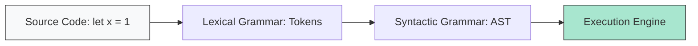

# CH-01: Grammar Fundamentals

> **"Batas-batas aliran data yang dipahami oleh mesin. `Grammar Fundamentals` adalah dasar dari bagaimana teks kode diubah menjadi struktur yang bisa dieksekusi oleh Hub."**

**Source Hub**: 
- [ECMA-262: Context-Free Grammars](https://tc39.es/ecma262/#sec-context-free-grammars)
- [ECMA-262: The Lexical Grammar](https://tc39.es/ecma262/#sec-ecmascript-language-lexical-grammar)
- [ECMA-262: The Syntactic Grammar](https://tc39.es/ecma262/#sec-ecmascript-language-syntactic-grammar)

---

## 1. Konsep & Esensi

**Definisi Arsitek**:
ECMAScript didefinisikan menggunakan **Context-Free Grammar (CFG)**. Bahasa ini memiliki tiga level tata bahasa utama: **Lexical** (mengubah karakter menjadi token), **Syntactic** (mengubah token menjadi struktur pohon/AST), dan **Numeric String** (mengatur konversi teks angka).

**Model Mental**:
Bayangkan Hub menerima pesan teks mentah.
- **Lexical**: Memecah kalimat menjadi kata-kata (Token).
- **Syntactic**: Memahami hubungan antar kata untuk membentuk perintah (Sentence).

---

## 2. Visualisasi Sistem: Analysis Pipeline

---

## 3. Mekanisme & Hubungan

### Tiga Pilar Tata Bahasa
1. **Lexical Grammar (Clause 5.1.2)**: Mengatur bagaimana input teks (Unicode) dikelompokkan menjadi elemen dasar seperti Kata Kunci, Literal, atau Operator.
2. **Syntactic Grammar (Clause 5.1.4)**: Mengatur bagaimana token-token tersebut disusun menjadi ekspresi dan pernyataan yang valid.
3. **Numeric String Grammar (Clause 5.1.3)**: Aturan khusus untuk mengubah string teks (seperti "0x123") menjadi nilai numerik internal Hub.

### Arsitek Mindset: Early Error Detection
- Kesalahan pada level Lexical atau Syntactic akan memicu **SyntaxError** bahkan sebelum kode mulai dijalankan. Ini adalah mekanisme pertahanan pertama Hub terhadap instruksi yang rusak.

---

## 4. Lab Praktis
Buka file `examples/grammar_analysis_lab.js` untuk melihat bagaimana sebuah baris kode dipecah menjadi token dan pohon sintaks manual menggunakan model CFG sederhana.

---
*Status: [status.md](../../../../../status.md)*
