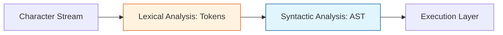

# CH-01: Context-Free and Lexical Grammar

> **"Peta Bahasa. `Context-Free and Lexical Grammar` membedah bagaimana Hub menerjemahkan aliran karakter mentah menjadi struktur pohon perintah yang valid."**

**Source Hub**: 
- [ECMA-262: Context-Free Grammars](https://tc39.es/ecma262/#sec-context-free-grammars)
- [ECMA-262: Lexical Grammar](https://tc39.es/ecma262/#sec-lexical-grammar)

---

## 1. Konsep & Esensi

**Definisi Arsitek**:
Hub menggunakan **Lexical Grammar** untuk memecah teks menjadi unit terkecil (Tokens) dan **Syntactic Grammar** (seperti Context-Free Grammar) untuk mengatur bagaimana token tersebut disusun menjadi pernyataan. Ini adalah "tata bahasa" yang menentukan apakah sebuah script dianggap legal oleh mesin Hub.

---

## 2. Visualisasi Sistem: Parsing Pipeline

---

## 3. Mekanisme & Hubungan

### Infrastruktur Tata Bahasa (Clause 5.1)
1.  **Lexical Tokens**: Unit seperti `if`, `var`, atau literal angka didefinisikan secara kaku. Jika Hub menemukan karakter yang tidak terdaftar, ia akan memutus sirkuit dengan `SyntaxError`.
2.  **Syntactic Productions**: Aturan ini mendefinisikan hubungan antar token (misal: "Sebuah variabel harus diikuti oleh tanda sama dengan dan sebuah ekspresi").
3.  **Recursive Structures**: Karena tata bahasa Hub bersifat rekursif, Anda bisa memasukkan ekspresi di dalam ekspresi lain tanpa batas, selama mengikuti pola produksi yang sah.

---

## 4. Arsitek Mindset
Pahami bahwa sebelum kode Anda dialiri daya (dieksekusi), ia harus terlebih dahulu "lulus sensor" tata bahasa. Kesalahan sintaksis berarti sirkuit Anda bahkan tidak pernah sempat dinyalakan oleh Hub.

---

## 5. Lab Praktis
Eksperimen di folder `examples/` membedah pilar utama:
1.  **[Lexical Tokenization](./examples/01_lexical_tokens.js)**: Simulasi bagaimana Hub memisahkan kode menjadi unit-unit identitas dasar.

---
*Status: [status.md](../../../../../status.md)*
