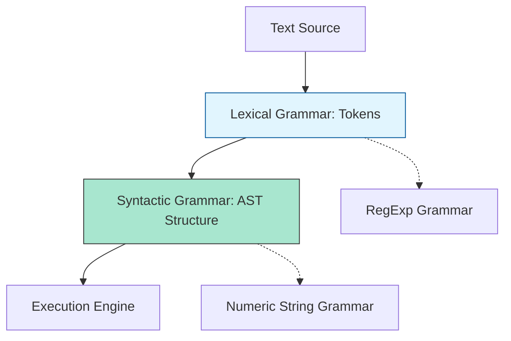
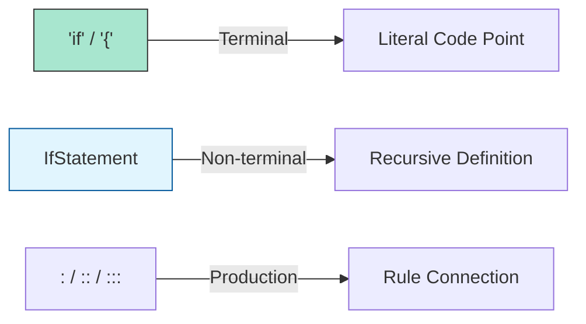

# CH-01: CFG and Primary Notation

> **"Abstraksi BNF dan Hirarki Grammar. `CFG and Primary Notation` membedah fondasi Backus-Naur Form (BNF) yang mendasari seluruh struktur sintaksis Hub."**

**Source Hub**: 
- [ECMA-262: Context-Free Grammars](https://tc39.es/ecma262/#sec-context-free-grammars)
- [ECMA-262: Grammar Notation](https://tc39.es/ecma262/#sec-grammar-notation)

---

## 1. Konsep & Esensi

**Definisi Arsitek**:
ECMAScript menggunakan **Context-Free Grammar (CFG)** yang direpresentasikan melalui variasi **BNF**. Spesifikasi memisahkan grammar menjadi empat lapisan: **Lexical** (tokenisasi), **Syntactic** (struktur perintah), **RegExp**, dan **Numeric String**. Setiap lapisan menjamin integritas data dari karakter mentah ke AST (Abstract Syntax Tree).

**Model Mental**:
- **Lexical Grammar**: Pembuat bata. Ia mengubah lumpur (karakter Unicode) menjadi bata (Token).
- **Syntactic Grammar**: Arsitek. Ia menyusun bata (Token) menjadi struktur bangunan (Statement/Expression).

---

## 2. Visualisasi Sistem: Multi-Layer Validation

### BNF Symbol Legend

---

## 3. Mekanisme & Hubungan

### Anatomi Notasi BNF (Clause 5.1.4)
1. **Productions (`:` or `::` or `:::`)**: 
   - `:` untuk Syntactic Grammar.
   - `::` untuk Lexical Grammar.
   - `:::` untuk RegExp Grammar.
2. **Terminal vs Non-terminal**: Terminal ditulis dengan font tetap (e.g., `if`), Non-terminal ditulis miring (e.g., *IfStatement*).
3. **Recursive Productions**: Banyak non-terminal di Hub bersifat rekursif (e.g., sebuah *Expression* bisa mengandung *Expression* lain), memungkinkan kedalaman logika tak terbatas.

### Arsitek Mindset: Structural Determinism
- Memahami hirarki grammar memungkinkan Anda mendiagnosis **Syntax Errors** dengan presisi. Jika Hub melempar error, itu berarti input Anda gagal dipetakan ke rantaian produksi BNF di level Lexical atau Syntactic. Jangan melawan grammar; bangunlah sirkuit yang selaras dengannya.

---

## 4. Lab Praktis
Buka file `examples/grammar_cfg_audit.js` untuk melihat bagaimana sebuah string diproses melalui filter Lexical dan Syntactic di level simulasi parser engine.

---
*Status: [status.md](../../../../../status.md)*
