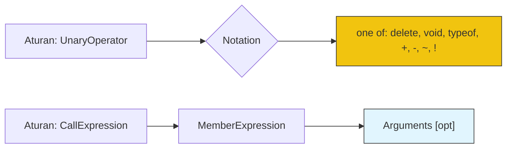
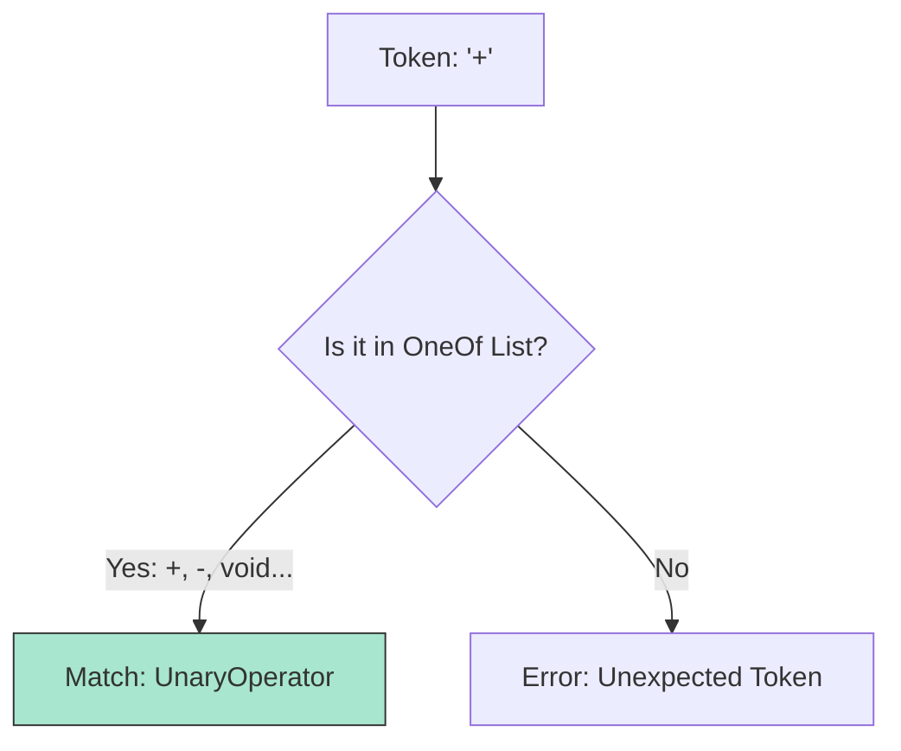

# CH-02: Optionality and OneOf

> **"Akselerator Produksi. `Optionality and OneOf` membedah notasi pemendek spesifikasi yang menjaga agar deklarasi tata bahasa tetap ringkas dan bebas redundansi."**

**Source Hub**: 
- [ECMA-262: Notational Conventions](https://tc39.es/ecma262/#sec-notational-conventions)

---

## 1. Konsep & Esensi

**Definisi Arsitek**:
Untuk menghindari duplikasi ribuan aturan, Hub menggunakan **Shortcuts**. **`[opt]`** menandakan opsionalitas di level simbol, sementara **`one of`** mendefinisikan set terminal yang saling eksklusif. Di level expert, kita juga mengenal notasi **"but not"** untuk membatasi set terminal tertentu (filter negatif).

**Model Mental**:
- **`[opt]`**: Pintu gerbang. Anda boleh lewat membawa barang atau tangan kosong.
- **`one of`**: Switch selector. Hanya satu jalur energi yang bisa aktif dari daftar yang tersedia.

---

## 2. Visualisasi Sistem: Production Tree Optimization

### OneOf Selector Logic

---

## 3. Mekanisme & Hubungan

### Optimasi Notasi (Clause 5.1.5 - 5.1.8)
1. **The `one of` Advantage**: Digunakan hampir di seluruh level lexer untuk mendefinisikan digit, operator, dan kata kunci tanpa harus menulis barisan produksi satu per satu.
2. **The "But Not" Constraint**: Sangat krusial dalam mendefinisikan Identifier. Contoh: "Simbol ini valid *tetapi bukan* salah satu dari ReservedWord".
3. **Empty Production (`[empty]`)**: Representasi formal di mana sebuah simbol tidak menghasilkan token apapun namun tetap valid secara struktural.

### Arsitek Mindset: Efficiency by Abstraction
- Terapkan pola `one of` saat Anda merancang skema validasi input untuk sistem Anda. Menentukan pilihan yang diizinkan secara deklaratif jauh lebih aman dan mudah di-audit daripada menggunakan logika imperatif `if-else` yang tersebar luas.

---

## 4. Lab Praktis
Buka file `examples/optional_notation_lab.js` untuk melihat bagaimana API Hub (seperti `acorn` atau `esprima`) merepresentasikan notasi `[opt]` dalam struktur node AST.

---
*Status: [status.md](../../../../../status.md)*
