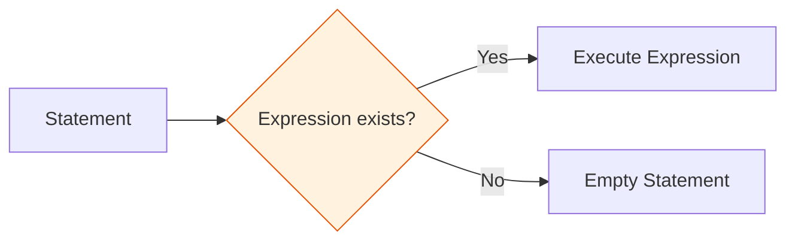

# CH-02: Grammar Shortcuts and Notation

> **"Shorthand Spesifikasi. `Grammar Shortcuts and Notation` membedah simbol-simbol efisiensi yang digunakan spesifikasi untuk mendeskripsikan aturan bahasa yang kompleks secara ringkas."**

**Source Hub**: 
- [ECMA-262: Notational Conventions](https://tc39.es/ecma262/#sec-notational-conventions)

---

## 1. Konsep & Esensi

**Definisi Arsitek**:
Untuk menghindari pengulangan teks yang membosankan, spesifikasi Hub menggunakan notasi khusus:
- **Optionality (`opt`)**: Bagian yang boleh ada atau tidak ada.
- **OneOf**: Pilihan dari daftar konstanta.
- **Lookahead**: Pengecekan token berikutnya tanpa benar-benar "memakannya".

---

## 2. Visualisasi Sistem: Optionality Logic

---

## 3. Mekanisme & Hubungan

### Simbol Efisiensi (Clause 5.1.5)
1.  **Production Rules**: Ditulis sebagai `NonTerminal : Terminal`. Ini adalah rumus dasar pembuatan perintah di Hub.
2.  **Lookahead Restriction**: Digunakan untuk mencegah ambiguitas, misalnya untuk memastikan bahwa `let[` tidak dianggap sebagai awal dari deklarasi variabel jika itu sebenarnya adalah akses properti array.
3.  **Chain Productions**: Jika beberapa aturan memiliki struktur yang mirip, spesifikasi menggabungkannya menggunakan parameter (seperti yang akan dibahas di unit berikutnya).

---

## 4. Arsitek Mindset
Bacalah notasi spesifikasi seperti membaca skema sirkuit. `opt` berarti sirkuit tersebut memiliki percabangan opsional yang tetap menjaga aliran energi tetap aman meskipun komponen tersebut tidak dipasang (tidak ditulis di kode).

---

## 5. Lab Praktis
Eksperimen di folder `examples/` membedah pilar utama:
1.  **[Grammar Logic](./examples/01_grammar_logic.js)**: Simulasi aturan tata bahasa yang memiliki komponen opsional dan pilihan konstanta.

---
*Status: [status.md](../../../../../status.md)*
