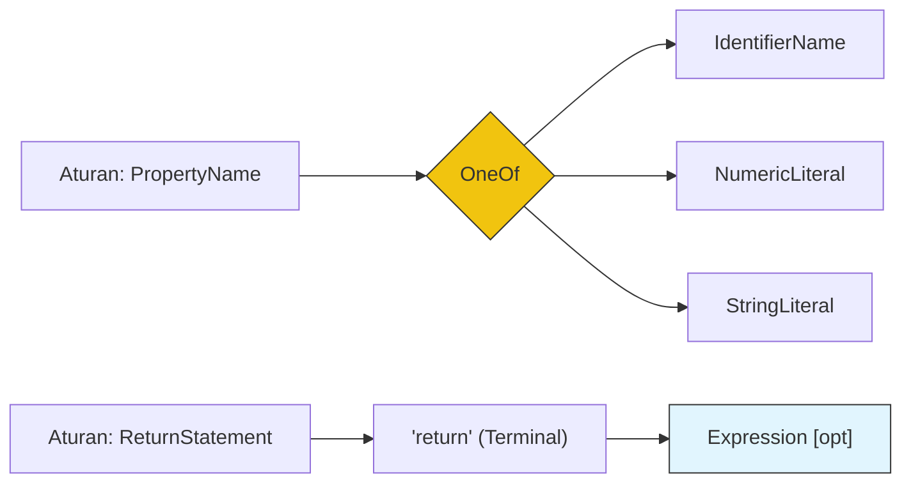

# CH-02: Optionality and OneOf

> **"Penyederhanaan rantaian produksi. `Optionality and OneOf` membedah cara Hub menulis aturan tata bahasa yang fleksibel tanpa harus menduplikasi ribuan baris instruksi."**

**Source Hub**: 
- [ECMA-262: Grammar Notation Shortcuts](https://tc39.es/ecma262/#sec-notational-conventions)

---

## 1. Konsep & Esensi

**Definisi Arsitek**:
Untuk menjaga spesifikasi tetap efisien, Hub menggunakan notasi jalan pintas. **Optionality (`[opt]`)** menandakan bahwa sebuah simbol boleh ada atau tidak ada. **OneOf** digunakan untuk mendaftarkan pilihan karakter tunggal dalam satu baris (biasanya untuk operator atau angka).

**Model Mental**:
Bayangkan Menu Restoran di Hub.
- **Optional (`[opt]`)**: "Nasi Goreng [opt] Telur" (Anda boleh pesan telur atau tidak).
- **OneOf**: "Pilihan Minuman [one of]: Teh, Kopi, Jus" (Hanya boleh pilih satu dari daftar tersebut).

---

## 2. Visualisasi Sistem: Decision Branching

---

## 3. Mekanisme & Hubungan

### Akselerator Grammar (Clause 5.1.5 - 5.1.8)
1. **The `[opt]` Marker**: Menghemat penulisan dua produksi yang hampir identik. Misalnya, `CallExpression` bisa memiliki `Arguments` atau tidak.
2. **One of Notation**: Mengelompokkan set terminal yang besar. Sangat krusial untuk mendefinisikan seluruh tombol operator Hub (`+`, `-`, `*`, `/`) dalam satu langkah audit yang ringkas.
3. **Descriptive Phrases**: Kadang Hub menggunakan kalimat penjelasan (seperti "any Unicode code point") jika notasi simbol terlalu rumit untuk dijabarkan.

### Arsitek Mindset: Compact Schema Design
- Belajarlah dari cara Hub menggunakan `[opt]`. Saat Anda merancang API atau skema database, gunakan pola opsionalitas yang jelas alih-alih membuat banyak endpoint yang hampir serupa. Ini menjaga integritas sistem dari "Code Bloat".

---

## 4. Lab Praktis
Buka file `examples/optional_grammar_lab.js` untuk melihat bagaimana Hub menguraikan pernyataan `return` dengan dan tanpa ekspresi tambahan menggunakan notasi `[opt]`.

---
*Status: [status.md](../../../../../status.md)*
