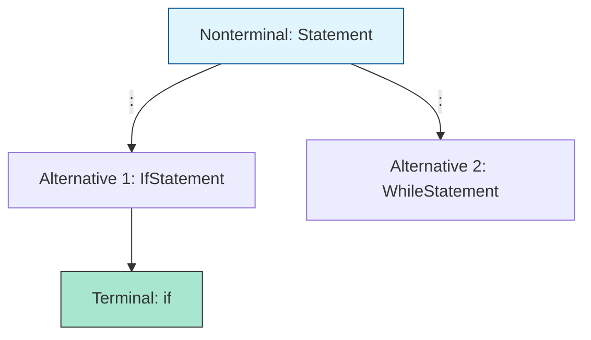

# CH-02: Production Notation

> **"Membaca simbol di balik tirai spesifikasi. `Production Notation` adalah alfabet yang digunakan para engineer ECMA untuk mendefinisikan struktur JavaScript."**

**Source Hub**: 
- [ECMA-262: Grammar Notation](https://tc39.es/ecma262/#sec-grammar-notation)
- [ECMA-262: Terminal Symbols](https://tc39.es/ecma262/#sec-terminal-symbols)

---

## 1. Konsep & Esensi

**Definisi Arsitek**:
Sebuah **Produksi** adalah aturan yang menetapkan bagaimana sebuah **Nonterminal** (abstraksi) dapat digantikan oleh urutan **Terminal** (simbol nyata) atau Nonterminal lainnya. Notasi ini bersifat rekursif dan presisi tinggi.

**Model Mental**:
- **Nonterminal (*Italic*)**: Seperti kategori barang ("Buah").
- **Terminal (`Fixed-Width`)**: Seperti barang nyata ("Apel", "Jeruk").
- **Produksi (`:`)**: Aturan yang bilang "Buah didefinisikan sebagai Apel atau Jeruk".

---

## 2. Visualisasi Sistem: Production Mapping

---

## 3. Mekanisme & Hubungan

### Simbol-Simbol Utama
1. **Terminal Symbols**: Karakter Unicode nyata (`if`, `{`, `+`). Tidak bisa dipecah lagi.
2. **Nonterminal Symbols**: Nama konsep (*Expression*, *Block*). Harus dipecah menjadi terminal agar bisa dieksekusi.
3. **Optional Symbols (`opt`)**: Menandakan bahwa sebuah bagian boleh ada atau tidak (misal: `;` opsional).
4. **one of**: Shorthand untuk daftar panjang terminal (misal: `SourceCharacter but not one of ...`).

### Arsitek Mindset: Spec-Literacy
- Biasakan melihat simbol miring sebagai "Kategori" dan simbol tegak sebagai "Kode Nyata". Kemampuan ini memangkas waktu Anda saat membaca proposal fitur baru JavaScript.

---

## 4. Lab Praktis
Buka file `examples/notation_mapping_lab.js` untuk berlatih membaca produksi `AdditiveExpression` dan menerjemahkannya ke dalam bentuk kode JavaScript yang valid.

---
*Status: [status.md](../../../../../status.md)*
