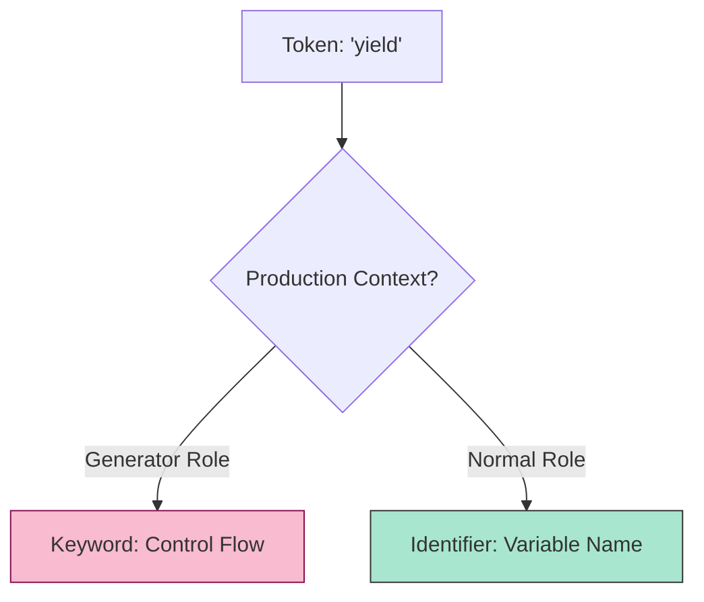

# CH-03: Grammar Parameters

> **"Konteks Tata Bahasa. `Grammar Parameters` membedah bagaimana aturan Hub berubah secara dinamis tergantung pada konteks tempat kode tersebut ditulis (Generator, Async, atau Module)."**

**Source Hub**: 
- [ECMA-262: Grammar Parameters](https://tc39.es/ecma262/#sec-grammar-parameters)

---

## 1. Konsep & Esensi

**Definisi Arsitek**:
Sebuah ekspresi yang sama bisa memiliki makna berbeda tergantung parameternya.
- **`[+Yield]`**: Di dalam generator, `yield` adalah keyword bermakna tinggi.
- **`[~Yield]`**: Di luar generator, `yield` hanyalah nama variabel biasa.
Parameter ini memastikan Hub tidak perlu menulis ulang ribuan aturan tata bahasa untuk setiap fitur baru.

---

## 2. Visualisasi Sistem: Context Switching

---

## 3. Mekanisme & Hubungan

### Parameter Utama (Clause 5.1.5)
1. **Inheritance**: Parameter mengalir ke bawah (inherited) dari fungsi ke sub-ekspresi di dalamnya, menjaga konsistensi konteks.
2. **The `Await` Flag**: Mirip dengan `Yield`, parameter `[+Await]` mengubah perilaku sirkuit saat berada di dalam fungsi `async`.
3. **Cross-Rack Linking**: Parameter tata bahasa menghubungkan **RAK-03** (Fitur Modern) dengan mesin inti di **RAK-04**, memungkinkan penambahan fitur baru tanpa merusak struktur lama.

---

## 4. Arsitek Mindset
Sadarilah konteks tempat Anda bekerja. Kode yang valid di satu tempat (misal: Script biasa) bisa jadi ilegal di tempat lain (misal: Module atau Async context) karena perbedaan parameter tata bahasa yang diterapkan oleh Hub.

---

## 5. Lab Praktis
Eksperimen di folder `examples/` membedah pilar utama:
1.  **[Parameter Context](./examples/01_parameter_context.js)**: Simulasi pergantian peran token `yield` dan `await` berdasarkan konteks eksekusi.

---
*Status: [status.md](../../../../../status.md)*
