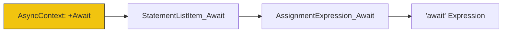

# CH-03: Grammatical Parameters and Constraints

> **"Propagasi Status dan Lookahead. `Grammatical Parameters and Constraints` membedah bagaimana Hub melacak status eksekusi (context) ke dalam rantaian validasi gramatikal."**

**Source Hub**: 
- [ECMA-262: Grammar Parameters](https://tc39.es/ecma262/#sec-grammar-parameters)
- [ECMA-262: Lookahead Restrictions](https://tc39.es/ecma262/#sec-lookahead-restrictions)

---

## 1. Konsep & Esensi

**Definisi Arsitek**:
Dua mekanisme tercanggih dalam grammar Hub adalah **Grammatical Parameters** (variabel pada non-terminal) dan **Lookahead Restrictions** (pembatasan simbol berikutnya). Parameter seperti `[Yield]` memastikan bahwa kata kunci `yield` hanya valid saat berada di dalam rantaian produksi Generator. Lookahead memastikan ambiguitas kode (seperti blok `{}` vs objek `{}`) dapat diselesaikan sebelum dieksekusi.

**Model Mental**:
- **Parameters**: Seperti pewarnaan sirkuit. Jika induknya "berwarna" `Async`, maka semua cabangnya akan ikut berwarna `Async` sampai rantaiannya selesai.
- **Lookahead**: Seperti radar. Sebelum melangkah ke depan, Hub memindai satu simbol di depannya untuk memutuskan arah jalur produksi.

---

## 2. Visualisasi Sistem: Parameter Flow

```mermaid
graph TD
    Parent[Function_Yield] --> Child[Statement_Yield]
    Child --> G{"'yield'"}
    G -->|Valid because of Parameter| Success[AST Node: YieldExpression]
    
    Parent2[Function] --> Child2[Statement]
    Child2 --> G2{"'yield'"}
    G2 --X|Invalid: Parameter Missing| Fail[SyntaxError]
    
    style Success fill:#a8e6cf,stroke:#333
    style Fail fill:#f8bbd0,stroke:#880e4f
```

### Contextual Flag Propagation


---

## 3. Mekanisme & Hubungan

### Logika Kontekstual (Clause 5.1.10 - 5.1.15)
1. **Parameter Prefixing**:
   - `+Await`: Mengaktifkan fungsionalitas await.
   - `~Yield`: Menonaktifkan fungsionalitas yield.
2. **Lookahead Control (`[lookahead ∉ {set}]`)**: Mencegah parser terjebak dalam ambiguitas statis. Contoh: *ExpressionStatement* dilarang dimulai dengan `{` karena akan disalahartikan sebagai *Block*.
3. **The `[In]` Parameter**: Menentukan apakah operator `in` diizinkan atau tidak dalam ekspresi relasional (khusus untuk inisialisasi loop `for`).

### Arsitek Mindset: Context Isolation
- Pahami bahwa sebuah fitur bahasa bisa beroperasi sangat berbeda hanya karena parameter konteksnya berubah. Selalu sadari "Zone" (Konteks) di mana kode Anda berada, terutama saat Anda mencampur logika asinkron dan sinkron di dalam Agent Hub.

---

## 4. Lab Praktis
Buka file `examples/grammar_params_lab.js` untuk menguji bagaimana Hub menangani teks `{} + []` sebagai penambahan objek vs blok kode kosong tergantung pada konteks gramatikalnya.

---
*Status: [status.md](../../../../../status.md)*
