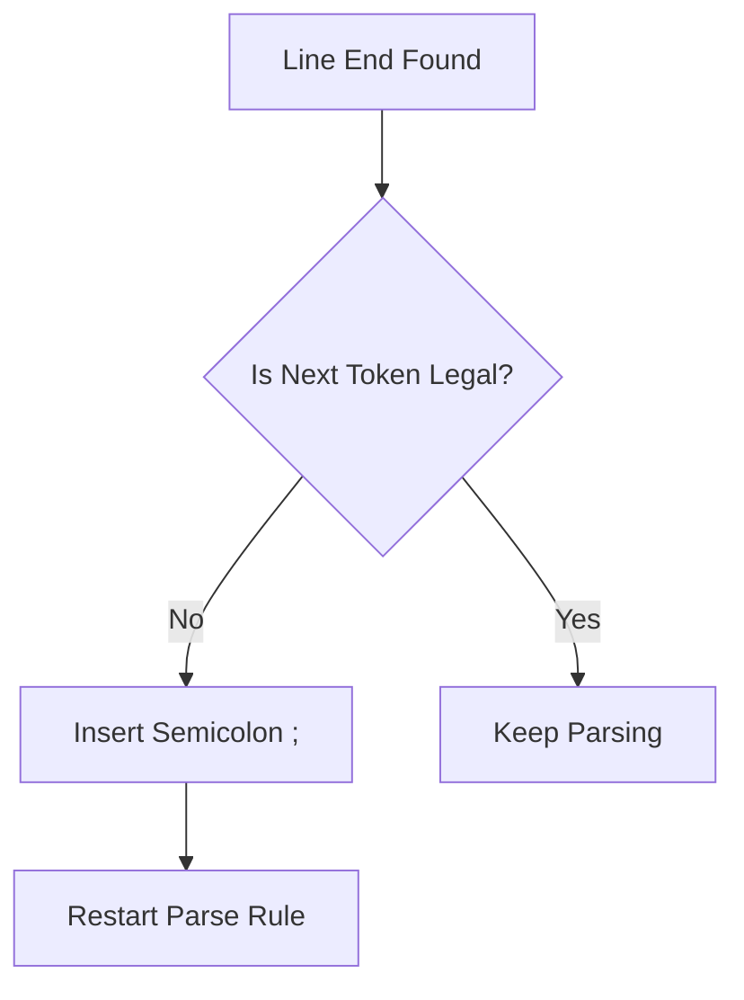

# CH-04: Line Restrictions and ASI

> **"Batas Sirkuit Baris. `Line Restrictions and ASI` membedah aturan titik koma otomatis dan batasan baris baru yang menentukan integritas pemisahan instruksi di Hub."**

**Source Hub**: 
- [ECMA-262: Automatic Semicolon Insertion](https://tc39.es/ecma262/#sec-automatic-semicolon-insertion)

---

## 1. Konsep & Esensi

**Definisi Arsitek**:
Hub memiliki mekanisme **Automatic Semicolon Insertion (ASI)** yang mencoba "memperbaiki" kode Anda dengan menyisipkan titik koma virtual jika ia menemukan batas baris yang valid. Namun, ada **Restricted Productions** di mana Hub melarang keras adanya baris baru (Line Terminator) di antara dua token tertentu.

---

## 2. Visualisasi Sistem: ASI Triggering

---

## 3. Mekanisme & Hubungan

### Aturan Pembatasan (Clause 12.9)
1.  **Restricted Productions**: Anda dilarang memberikan baris baru tepat setelah `return`, `throw`, `yield`, `break`, atau `continue`. Jika dilakukan, Hub akan memasukkan titik koma tepat setelah keyword tersebut, yang seringkali memutus aliran data Anda secara pre-mature.
2.  **The Error Trigger**: ASI dipicu saat parser menemui sebuah "Offending Token" (token yang menabrak aturan tata bahasa).
3.  **Ambiguity Protection**: Aturan ini ada untuk melindungi Hub dari ambiguitas, misalnya mencegah `return` dan baris baru di bawahnya dianggap sebagai satu kesatuan ekspresi.

---

## 4. Arsitek Mindset
Jangan mengandalkan ASI untuk stabilitas sirkuit Anda. Selalu gunakan titik koma secara eksplisit, terutama pada instruksi yang sensitif terhadap aliran (seperti `return`), untuk menghindari "sirkuit putus" yang disebabkan oleh perbaikan otomatis Hub.

---

## 5. Lab Praktis
Eksperimen di folder `examples/` membedah pilar utama:
1.  **[ASI Simulation](./examples/01_asi_simulation.js)**: Demonstrasi bagaimana baris baru setelah keyword `return` memicu penyisipan titik koma tak terduga.

---
*Status: [status.md](../../../../../status.md)*
