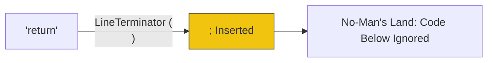

# CH-04: Line Terminator and ASI Logic

> **"Resolusi Ambiguitas Baris. `Line Terminator and ASI Logic` membedah 'kecerdasan buatan' primitif di dalam parser Hub yang secara otomatis menyuntikkan terminasi titik koma."**

**Source Hub**: 
- [ECMA-262: Automatic Semicolon Insertion](https://tc39.es/ecma262/#sec-automatic-semicolon-insertion)

---

## 1. Konsep & Esensi

**Definisi Arsitek**:
**Automatic Semicolon Insertion (ASI)** adalah mekanisme penyelamatan di level Syntactic Grammar. Hub memiliki **3 Aturan Emas** untuk memutuskan kapan sebuah `;` harus disuntikkan secara virtual. Selain itu, ada **Restricted Productions** di mana keberadaan `LineTerminator` dilarang keras di antara dua simbol kritis.

**Model Mental**:
- **ASI**: Asisten korektor yang menyuntikkan titik koma hanya jika kalimat Anda benar-benar meledak (Error) atau berakhir dengan `{ }`.
- **Restricted**: "Dilarang jeda". Jika Anda mengambil napas (New Line) di tengah kalimat perintah `return`, Hub akan mengira kalimat tersebut sudah berakhir.

---

## 2. Visualisasi Sistem: ASI Flow Chart (Clause 12.9.1)

```mermaid
graph TD
    Fail[Grammar Error Detected?] --> Rule1{Is it a '}'?}
    Rule1 -->|Yes| Insert[Insert ';' & Retry]
    Rule1 -->|No| Rule2{Is it a LineTerminator?}
    Rule2 -->|Yes| Insert
    Rule2 -->|No| Rule3{Is it EOF?}
    Rule3 -->|Yes| Insert
    Rule3 -->|No| Throw[Throw SyntaxError]
    
    style Insert fill:#a8e6cf,stroke:#333
    style Throw fill:#f8bbd0,stroke:#880e4f
```

### Restricted Production Hazard


---

## 3. Mekanisme & Hubungan

### 3 Aturan Emas ASI
1. **The Offending Token**: Jika token saat ini tidak diizinkan oleh grammar, dan ia didahului oleh baris baru atau diawali oleh `}`, suntikkan `;`.
2. **The End of Stream**: Jika akhir kode tercapai tanpa `;`, Hub menyuntikkannya secara otomatis.
3. **The Restricted Production Error**: Jika baris baru ditemukan di titik dilarang (setiap `return`, `throw`, `break`, `continue`, `yield`, atau `await`), ASI akan dipicu SECARA PAKSA, seringkali memotong data di bawahnya.

### Arsitek Mindset: Predictable Termination
- Di level Arsitek, mengandalkan ASI adalah "unprofessional behavior" karena ia memperkenalkan ketidakkerasan (softness) pada sirkuit. Selalu gunakan tanda baca eksplisit untuk menjamin bahwa maksud arsitektural Anda tidak "ditebak" oleh asisten otomatis engine Hub.

---

## 4. Lab Praktis
Buka file `examples/asi_logic_lab.js` untuk melihat bagaimana `return \n 10` dievaluasi menjadi `undefined` dan bagaimana `(a+b)\n [1,2].map()` menyebabkan error runtime yang fatal.

---
*Status: [status.md](../../../../../status.md)*
