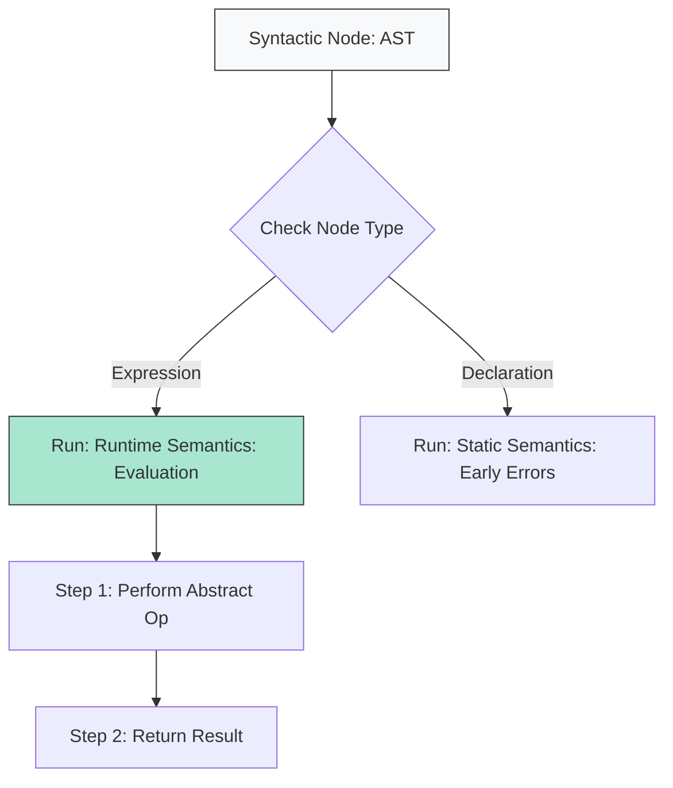

# CH-01: Evaluation and Runtime

> **"Langkah demi langkah dalam menggerakkan sirkuit Hub. `Evaluation and Runtime` adalah panduan urutan eksekusi algoritma di dalam spesifikasi."**

**Source Hub**: 
- [ECMA-262: Algorithm Conventions](https://tc39.es/ecma262/#sec-algorithm-conventions)
- [ECMA-262: Abstract Operations](https://tc39.es/ecma262/#sec-abstract-operations)
- [ECMA-262: Syntax-Directed Operations](https://tc39.es/ecma262/#sec-syntax-directed-operations)

---

## 1. Konsep & Esensi

**Definisi Arsitek**:
Algoritma dalam spesifikasi JavaScript ditulis dalam langkah-langkah bernomor. **Evaluation** adalah proses mengubah struktur sintaks menjadi nilai runtime. Terdapat dua jenis operasi utama: **Abstract Operations** (fungsi internal global) dan **Syntax-Directed Operations** (operasi yang terikat pada tipe sintaks tertentu).

**Model Mental**:
Bayangkan sebuah manual instruksi perakitan Hub.
- **Urutan**: Langkah 1 harus selesai sebelum langkah 2.
- **Abstract Ops**: Seperti instruksi umum "Sambungkan kabel A ke B".
- **Syntax-Directed Ops**: Seperti instruksi khusus "Jika unitnya adalah Tipe X, lakukan Y".

---

## 2. Visualisasi Sistem: Algorithm Execution Flow

---

## 3. Mekanisme & Hubungan

### Jenis Operasi Internal
1. **Abstract Operations (Clause 7)**: Prosedur internal yang dipanggil oleh langkah-langkah dalam algoritma (Contoh: `ToNumber`, `Get`, `Set`).
2. **Syntax-Directed Operations**: Operasi yang definisinya bergantung pada struktur sintaks (Contoh: cara mengevaluasi `IfStatement` berbeda dengan `WhileStatement`).
3. **Execution Order**: Secara default, algoritma dieksekusi secara linear (berurutan) kecuali jika ada instruksi "Repeat" atau "Return".

### Arsitek Mindset: Spec-Literacy
- Saat membaca algoritma, perhatikan kata kerja tebal. Mereka biasanya merujuk ke **Abstract Operations** lain yang dibedah di Clause 7. Memahami keterkaitan ini memudahkan Anda melacak "Ujung" dari sebuah operasi.

---

## 4. Lab Praktis
Buka file `examples/algorithm_trace_lab.js` untuk berlatih mendeteksi urutan evaluasi pada ekspresi kompleks menggunakan model langkah-demi-langkah spesifikasi.

---
*Status: [status.md](../../../../../status.md)*
