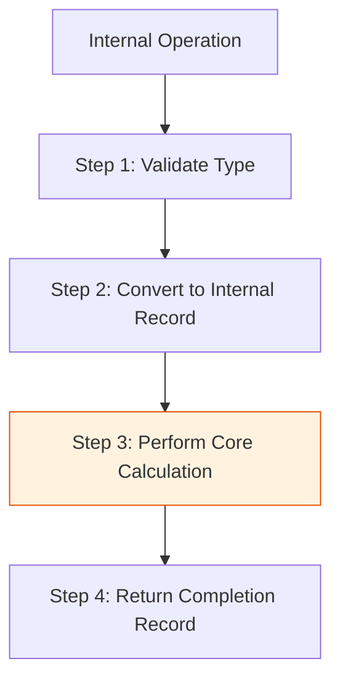

# CH-01: Evaluation Logic & Step Execution

> **"Ritme Eksekusi Internal. `Evaluation Logic & Step Execution` membedah bagaimana Hub memecah setiap perintah menjadi langkah-langkah mikro yang deterministik dan prosedural."**

**Source Hub**: 
- [ECMA-262: Algorithm Conventions](https://tc39.es/ecma262/#sec-algorithm-conventions)

---

## 1. Konsep & Esensi

**Definisi Arsitek**:
Setiap instruksi di Hub dijalankan melalui algoritma yang terdiri dari urutan **Langkah (Steps)** bernomor. Ini adalah "SOP Mesin" yang menjamin bahwa setiap implementer engine (V8, WebKit, dst) menghasilkan perilaku yang identik saat mengeksekusi kode Anda.

---

## 2. Visualisasi Sistem: Sequential Execution Flow

---

## 3. Mekanisme & Hubungan

### Anatomi Algoritma (Clause 5.2)
1. **Numbered Steps**: Langkah bernomor memberikan urutan kronologis. Jika satu langkah gagal (throw), langkah berikutnya tidak akan pernah dialiri daya.
2. **Implicit Context**: Algoritma sering bergantung pada konteks tersembunyi seperti `this value` atau `Running Execution Context`.
3. **Sub-Steps**: Langkah besar dapat memiliki sub-langkah (a, b, c) untuk menangani percabangan logika yang lebih detail tanpa merusak alur utama.

---

## 4. Arsitek Mindset
Bacalah algoritma spesifikasi seperti membaca instruksi perakitan mesin. Keandalan JavaScript bukan berasal dari "sihir", tapi dari kepatuhan mesin terhadap setiap langkah mikro yang didefinisikan secara kaku di sini.

---

## 5. Lab Praktis
Eksperimen di folder `examples/` membedah pilar utama:
1.  **[Step Execution](./examples/01_step_execution.js)**: Simulasi bagaimana Hub membedah satu operasi menjadi empat langkah prosedural yang berbeda.

---
*Status: [status.md](../../../../../status.md)*
