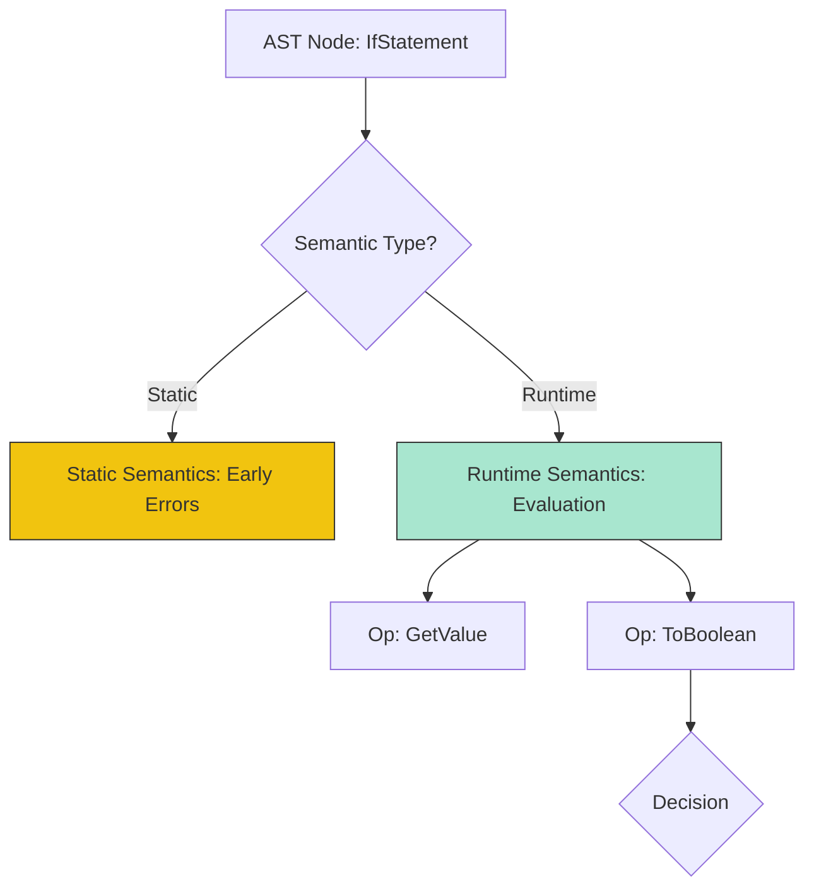

# CH-01: Abstract Operations and Evaluation

> **"Protokol Eksekusi dan Operasi Abstrak. `Abstract Operations and Evaluation` membedah bagaimana Hub mengevaluasi teks kode melalui serangkaian algoritma yang terdefinisi secara kaku."**

**Source Hub**: 
- [ECMA-262: Algorithm Conventions](https://tc39.es/ecma262/#sec-algorithm-conventions)
- [ECMA-262: Abstract Operations](https://tc39.es/ecma262/#sec-abstract-operations)

---

## 1. Konsep & Esensi

**Definisi Arsitek**:
Setiap instruksi di Hub dijalankan melalui **Evaluation Algorithms**. Spesifikasi menggunakan **Abstract Operations**—kumpulan fungsi logika internal (seperti `Call`, `ToNumber`, `Get`) yang tidak terlihat oleh teknisi tapi menjadi bahan bangunan seluruh fitur bahasa. Perilaku algoritma ini bersifat **Syntax-Directed**, artinya langkah-langkahnya ditentukan oleh bentuk struktur kode di AST.

**Model Mental**:
- **Evaluation**: Seperti menjalankan skrip di command line. Hub membaca baris demi baris perintah sirkuit.
- **Abstract Operations**: Modul-modul utilitas internal Hub. Mereka adalah blok bangunan logika yang digunakan berulang kali untuk menjamin konsistensi sirkuit.

---

## 2. Visualisasi Sistem: Evaluation Dispatch (Clause 5.2)



### Operation Dispatch Architecture
```mermaid
graph LR
    User[Code: obj.prop] --> Spec[Abstract Op: GetValue]
    Spec --> Int[[[Get]]]
    Int -->|Default| Ord[Ordinary Property Access]
```

---

## 3. Mekanisme & Hubungan

### Tipologi Operasi (Clause 5.2.1 - 5.2.5)
1. **Runtime Semantics**: Algoritma yang mendefinisikan apa yang terjadi saat kode barulah dijalankan.
2. **Static Semantics**: Algoritma yang dijalankan sebelum eksekusi (Validasi).
3. **Implicit Parameters**: Banyak operasi abstrak menerima parameter tersembunyi seperti `thisValue` atau `NewTarget`.
4. **Operation Dispatch**: Memahami bahwa `Call(F, V, arguments)` adalah jembatan utama antara kode pengguna dan mesin internal Hub.

### Arsitek Mindset: Predictable Logic
- Di level teknisi senior, Anda harus mampu memvisualisasikan **Abstract Operations** yang sedang bekerja di balik kode Anda. Saat Anda menulis `obj[key]`, sadarilah bahwa Hub sedang melakukan rantaian operasi `ToPropertyKey(key)` diikuti oleh `obj.[[Get]](key, obj)`. Pengetahuan ini krusial untuk mengoptimalkan performa sirkuit.

---

## 4. Lab Praktis
Buka file `examples/abstract_op_audit.js` untuk melacak rantaian operasi abstrak yang terjadi saat sebuah properti diakses dan dikonversi menjadi tipe data lain.

---
*Status: [status.md](../../../../../status.md)*
