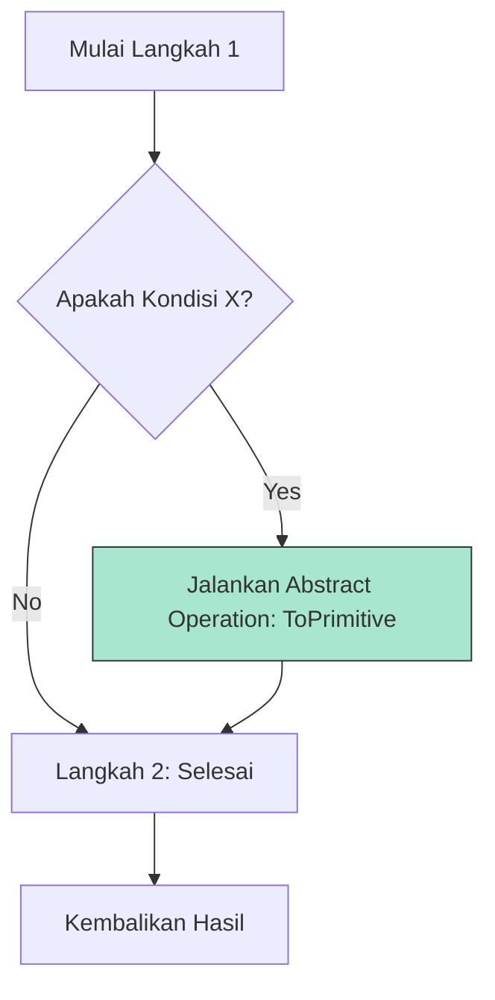

# CH-01: Abstract Operations and Evaluation

> **"Urutan perintah sirkuit. `Abstract Operations and Evaluation` membedah bagaimana Hub menjalankan langkah-langkah logika secara berurutan dan terstandarisasi."**

**Source Hub**: 
- [ECMA-262: Algorithm Conventions](https://tc39.es/ecma262/#sec-algorithm-conventions)

---

## 1. Konsep & Esensi

**Definisi Arsitek**:
Setiap fitur di Hub didefinisikan melalui serangkaian langkah langkah-demi-langkah. **Abstract Operations** adalah fungsi internal (seperti `ToNumber` atau `Get`) yang digunakan berulang kali di seluruh spesifikasi. **Evaluation** adalah proses mengubah teks kode menjadi aksi nyata melalui urutan langkah yang kaku.

**Model Mental**:
- **Steps**: Seperti resep masakan. "Langkah 1: Ambil telur, Langkah 2: Pecahkan telur."
- **Abstract Operations**: Seperti teknik memasak standar (misal: "Tumis"). Resep tidak menjelaskan cara menumis setiap saat, ia hanya merujuk pada teknik "Tumis" yang sudah didefinisikan di buku teknik dasar.

---

## 2. Visualisasi Sistem: Algorithm Flow

---

## 3. Mekanisme & Hubungan

### Anatomi Algoritma (Clause 5.2)
1. **Implicit Parameters**: Banyak algoritma memiliki akses otomatis ke konteks eksekusi saat ini (`thisValue`, `NewTarget`).
2. **Step Numbering**: Menggunakan sistem poin (1, 2, 3) dan sub-poin (a, b, c) untuk percabangan logika yang sangat presisi.
3. **Syntax-Directed Operations**: Operasi yang perilakunya ditentukan oleh bentuk sintaksis teks kode (seperti bagaimana `+` bekerja beda pada String vs Number).

### Arsitek Mindset: Algorithmic Rigor
- Berhentilah menebak perilaku JavaScript. Jika Anda ragu bagaimana sebuah fitur bekerja, telusurilah "Langkah-demi-Langkah" di spesifikasinya. Ini adalah satu-satunya cara untuk memahami kebenaran mutlak dari sirkuit yang Anda bangun di Hub.

---

## 4. Lab Praktis
Buka file `examples/algorithm_tracing_lab.js` untuk melihat perbandingan antara kode JavaScript sederhana dan padanan langkah-langkah algoritmanya di spesifikasi ECMA-262.

---
*Status: [status.md](../../../../../status.md)*
