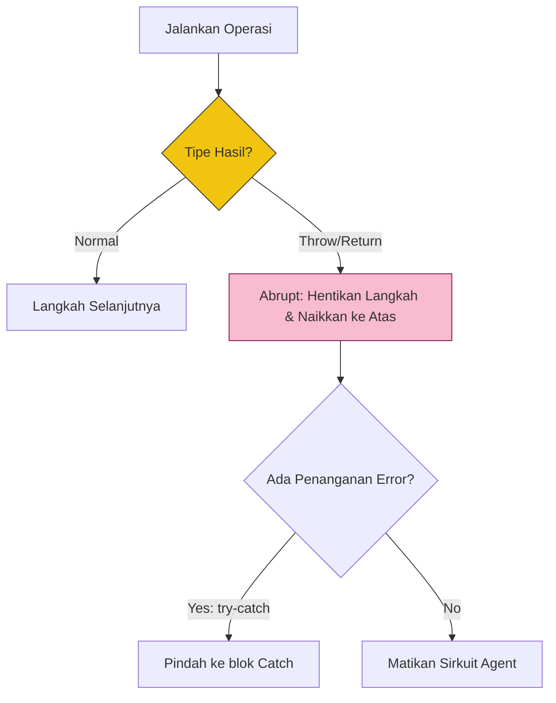

# CH-02: Completion Records and Errors

> **"Protokol laporan status. `Completion Records and Errors` adalah cara Hub melaporkan apakah sebuah misi berhasil, gagal, atau melompat keluar dari jalur normal."**

**Source Hub**: 
- [ECMA-262: Completion Records](https://tc39.es/ecma262/#sec-completion-record-specification-type)

---

## 1. Konsep & Esensi

**Definisi Arsitek**:
Hampir setiap langkah di spesifikasi mengembalikan sebuah **Completion Record**. Ini adalah paket data yang berisi tiga informasi: **[[Type]]** (Normal, Break, Continue, Return, atau Throw), **[[Value]]** (hasilnya), dan **[[Target]]** (label tujuan). **Abrupt Completion** terjadi jika tipenya bukan "Normal".

**Model Mental**:
Bayangkan utusan yang kembali membawa laporan:
- **Normal**: "Ini barangnya, misi selesai."
- **Throw**: "Gagal! Ada ledakan di sirkuit!" (Membawa error).
- **Return**: "Ini barangnya, dan saya langsung pulang." (Keluar dari fungsi).

---

## 2. Visualisasi Sistem: Completion Dispatcher

---

## 3. Mekanisme & Hubungan

### Mekanisme Pengembalian (Clause 6.2.4)
1. **Normal Completion**: Aliran data berlanjut ke langkah berikutnya tanpa interupsi.
2. **Abrupt Completion**: Aliran data segera berhenti di titik tersebut dan "bergelembung" (bubbles up) ke konteks eksekusi di atasnya sampai ditemukan penangan (seperti `try-catch`).
3. **The `?` and `!` Shorthand**: 
   - `?` (ReturnIfAbrupt): Jika gagal, segera lempar ke atas. Jika sukses, ambil nilainya saja.
   - `!` (No-Failure Guarantee): Hub menjamin langkah ini tidak akan pernah gagal (pasti Normal).

### Arsitek Mindset: Safe Propagation
- Memahami Completion Records akan mengubah cara Anda menulis logika error. Jangan biarkan sirkuit Anda "mati" secara misterius; pastikan setiap alur asinkron atau logika berat memiliki jalur pengembalian status (Try-Catch) yang jelas untuk menangani *Abrupt Completion*.

---

## 4. Lab Praktis
Buka file `examples/completion_record_sim.js` untuk melihat simulasi bagaimana sebuah "Abrupt Return" menghentikan seluruh rantaian loop di dalam fungsi secara instan di level engine.

---
*Status: [status.md](../../../../../status.md)*
