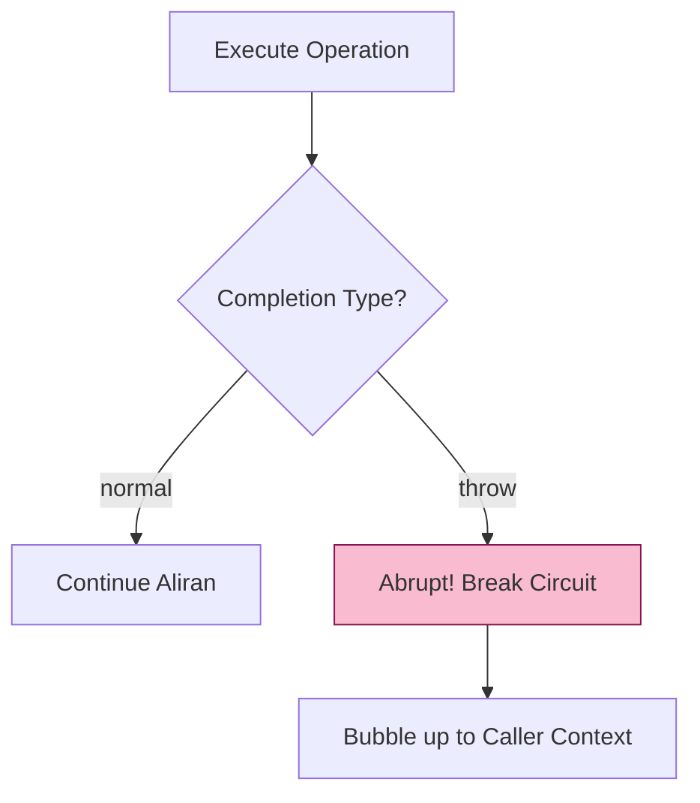

# CH-02: Completion Records and Status Flow

> **"Protokol Rambatan Status. `Completion Records and Status Flow` membedah bagaimana Hub melacak keberhasilan, kegagalan, dan interupsi eksekusi di level spesifikasi."**

**Source Hub**: 
- [ECMA-262: Completion Record Specification Type](https://tc39.es/ecma262/#sec-completion-record-specification-type)

---

## 1. Konsep & Esensi

**Definisi Arsitek**:
Setiap langkah algoritma mengembalikan sebuah **Completion Record**. Ia adalah wadah status yang memberi tahu Hub: "Apakah eksekusi ini `normal`, `return`, `throw`, `break`, atau `continue`?". Inilah mekanisme yang memungkinkan error di satu fungsi bisa "meledak" (bubble up) sampai ke penangan catch yang tepat.

---

## 2. Visualisasi Sistem: Abrupt Completion Circuit

---

## 3. Mekanisme & Hubungan

### Infrastruktur Status (Clause 6.2.4)
1. **Normal Completion**: Eksekusi berjalan mulus tanpa interupsi.
2. **Abrupt Completion**: Segala status yang memutus alur normal (misal: Error/Throw). Saat ini terjadi, Hub segera mencari sirkuit penyelamat (`try...catch`) terdekat.
3. **The Shorthand Operators**: Spesifikasi menggunakan `?` (ReturnIfAbrupt) untuk menghemat penulisan pengecekan status manual pada setiap langkah.

---

## 4. Arsitek Mindset
Jangan melihat error (`throw`) sebagai kegagalan sistem, tapi sebagai **Sinyal Status Abrupt**. Penggunaan `try...catch` yang bijak adalah cara arsitek membelokkan kembali status *abrupt* menjadi status *normal* agar sirkuit aplikasi tetap menyala.

---

## 5. Lab Praktis
Eksperimen di folder `examples/` membedah pilar utama:
1.  **[Completion Flow](./examples/01_completion_flow.js)**: Simulasi bagaimana Hub mendeteksi tipe completion 'normal' vs 'throw' di level internal.

---
*Status: [status.md](../../../../../status.md)*
