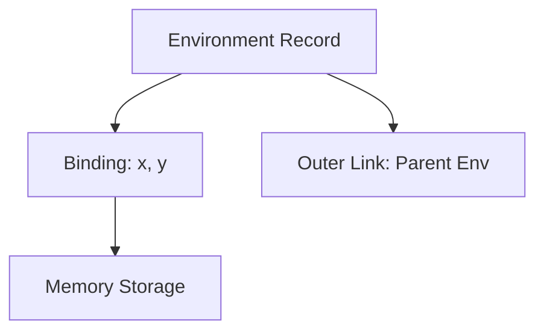

# CH-03: Internal Data & Environment Simulation

> **"Wadah Eksekusi. `Internal Data & Environment Simulation` membedah bagaimana Hub mengelola penyimpanan variabel dan status eksekusi melalui Environment Records."**

**Source Hub**: 
- [ECMA-262: Environment Records](https://tc39.es/ecma262/#sec-environment-records)

---

## 1. Konsep & Esensi

**Definisi Arsitek**:
**Environment Record** adalah struktur data internal tempat Hub mendaftarkan (binding) setiap nama variabel dan fungsinya. Setiap kali Anda mendeklarasikan sesuatu, Hub mencatatnya di dalam Record ini sebagai bagian dari status eksekusi aktif.

---

## 2. Visualisasi Sistem: Environment record Schema

---

## 3. Mekanisme & Hubungan

### Struktur Lingkungan (Clause 9.1)
1. **Declarative Environments**: Digunakan untuk menyimpan variabel dari deklarasi `const`, `let`, dan `function`.
2. **Object Environments**: Digunakan untuk mengikat properti dari objek global atau blok `with` ke dalam ruang lingkup variabel.
3. **Function Environments**: Rekaman khusus yang juga menyimpan informasi tentang nilai `this` dan `super`.

---

## 4. Arsitek Mindset
Setiap akses variabel di Hub adalah proses pencarian di dalam sirkuit Environment Record. Jika Hub tidak menemukannya di record aktif, ia akan memanjat melalui jalur **Outer Link** sampai ke lingkungan global—inilah yang kita sebut sebagai *Scope Chain*.

---

## 5. Lab Praktis
Eksperimen di folder `examples/` membedah pilar utama:
1.  **[Environment Simulation](./examples/01_env_simulation.js)**: Simulasi pembuatan binding variabel dan pencarian identitas di dalam sirkuit lingkungan internal.

---
*Status: [status.md](../../../../../status.md)*
