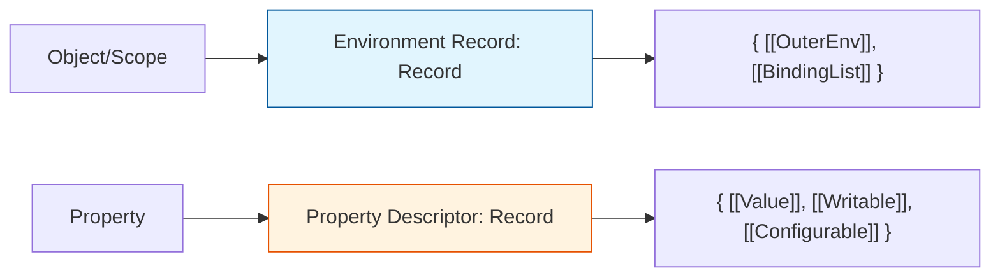

# CH-03: Records, Lists, and Internal Data

> **"Infrastruktur Data Spesifikasi. `Records, Lists, and Internal Data` membedah struktur penyimpanan privat yang digunakan oleh engine Hub untuk mengelola status eksekusi."**

**Source Hub**: 
- [ECMA-262: List and Record Specification Types](https://tc39.es/ecma262/#sec-list-and-record-specification-type)

---

## 1. Konsep & Esensi

**Definisi Arsitek**:
Untuk beroperasi, Hub memerlukan struktur data internal yang tidak bisa diotak-atik oleh teknisi melalui kode. **Record** didefinisikan sebagai kumpulan field statis yang ditulis dengan kurung siku ganda (e.g., `{ [[Value]], [[Writable]] }`). **List** adalah urutan nilai murni. Struktur-struktur ini menjadi fondasi bagi **Environment Records** (tempat variabel disimpan) dan **Global Object** di dalam memori.

**Model Mental**:
- **Record**: Sebuah formulir identitas rahasia. Hub mengisi data di kolom-kolom tertentu dan membacanya untuk memutuskan perilaku objek.
- **List**: Sebuah antrean atau tumpukan instruksi yang kaku.

---

## 2. Visualisasi Sistem: Memory Record Blueprint

---

## 3. Mekanisme & Hubungan

### Tipologi Data Internal (Clause 6.2.1 - 6.2.3)
1. **Records**: Setiap field (tanda `[[ ]]`) adalah kunci akses yang memandu logika algoritma. Jika sebuah field tidak ada, spesifikasi mengasumsikan nilai default atau "undefined".
2. **Lists**: Digunakan secara eksklusif dalam transmisi argumen fungsi dan pemrosesan modul (`[[RequestedModules]]`).
3. **Internal Methods as Record Fields**: Banyak Record yang juga menyimpan pointer ke algoritma (metode), seperti `[[Get]]` atau `[[Set]]`.

### Arsitek Mindset: Metadata Awareness
- Arsitektur sistem yang hebat tidak hanya peduli pada "Data", tapi juga pada "Metadata". Memahami bagaimana Hub menyimpan status variabel di dalam **Environment Record** akan membantu Anda menguasai konsep **Closure** dan **Scope Chain** secara mutlak dan mendalam.

---

## 4. Lab Praktis
Buka file `examples/internal_state_mapping.js` untuk melihat pemetaan antara variabel JavaScript ke dalam struktur **Environment Record** virtual di level spesifikasi.

---
*Status: [status.md](../../../../../status.md)*
