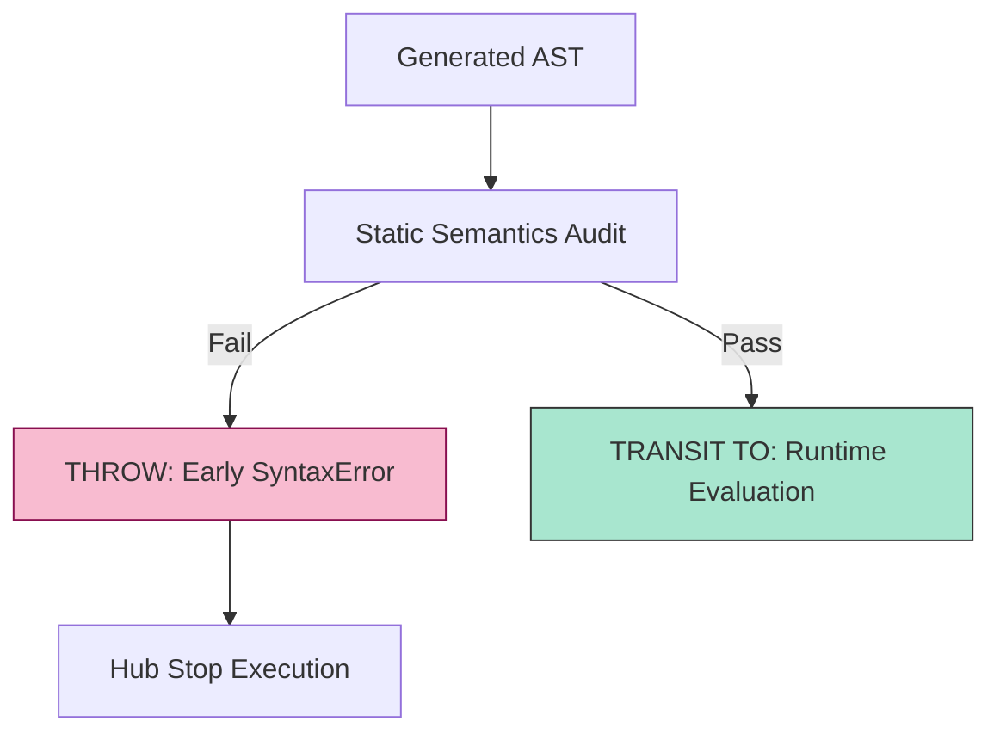

# CH-03: Static Semantics

> **"Filter keamanan sebelum energi mulai mengalir. `Static Semantics` adalah aturan yang memvalidasi struktur blueprint bahkan sebelum satu baris kode pun dieksekusi."**

**Source Hub**: 
- [ECMA-262: Static Semantic Rules](https://tc39.es/ecma262/#sec-static-semantic-rules)

---

## 1. Konsep & Esensi

**Definisi Arsitek**:
**Static Semantics** adalah sekumpulan aturan yang dijalankan oleh mesin JavaScript pada fase kompilasi/parsing (setelah AST terbentuk tapi sebelum eksekusi). Tugas utamanya adalah mendeteksi **Early Errors**—kesalahan yang tidak bisa ditoleransi meskipun berada di jalur kode yang tidak pernah dieksekusi.

**Model Mental**:
Bayangkan seorang pengawas Grid yang memeriksa denah instalasi kabel Anda. Sebelum saklar utama dinyalakan, pengawas sudah bisa bilang: "Ini salah, ada dua kabel dengan nama yang sama di satu sirkuit." (Duplicate parameter names).

---

## 2. Visualisasi Sistem: Early Error Guard

---

## 3. Mekanisme & Hubungan

### Contoh Aturan Statis Utama
1. **Duplicate Labels**: Anda tidak boleh memiliki dua label yang sama dalam kontainer yang sama.
2. **Const Initialization**: Variabel `const` harus diberi nilai saat dideklarasikan.
3. **Double Defaults**: Parameter fungsi tidak boleh memiliki nama duplikat jika ada parameter default atau rest.
4. **Early Use of let/const**: Deteksi TDZ (Temporal Dead Zone) secara statis di dalam lingkup yang sama.

### Arsitek Mindset: Structural Integrity
- Sebagai arsitek, hargailah **SyntaxError**. Ini bukan hambatan, melainkan "Sirkuit Pemutus" (Circuit Breaker) yang mencegah Hub Anda menjalankan instruksi yang secara fundamental cacat dan berpotensi merusak integritas Grid.

---

## 4. Lab Praktis
Buka file `examples/early_error_lab.js` untuk melihat perbedaan antara kesalahan yang tertangkap di fase **Static Semantics** (instan) dan kesalahan yang baru muncul saat **Runtime**.

---
*Status: [status.md](../../../../../status.md)*
