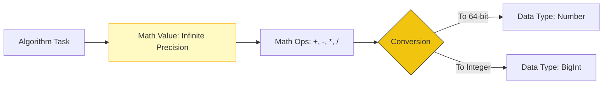

# CH-04: Mathematical Operations

> **"Matematika murni di balik dunia digital. `Mathematical Operations` mendefinisikan bagaimana angka dihitung dengan presisi tak terbatas sebelum dikonversi ke format Grid."**

**Source Hub**: 
- [ECMA-262: Mathematical Operations](https://tc39.es/ecma262/#sec-mathematical-operations)
- [ECMA-262: Value Notation](https://tc39.es/ecma262/#sec-value-notation)

---

## 1. Konsep & Esensi

**Definisi Arsitek**:
Dalam spesifikasi, operasi matematika (seperti penambahan atau perkalian) seringkali dilakukan menggunakan **mathematical values (MV)**—yaitu angka ideal dengan presisi tak terbatas. Ini berbeda dengan tipe data `Number` (IEEE 754) atau `BigInt`. Setelah perhitungan ideal selesai, hasilnya baru dikonversi ke representasi data yang sesuai.

**Model Mental**:
Bayangkan arsitek merancang Hub menggunakan perhitungan matematika murni di atas kertas (MV). Setelah angka idealnya didapat, baru kemudian angka tersebut diaplikasikan pada komponen fisik (Number/BigInt) yang memiliki keterbatasan daya tampung.

---

## 2. Visualisasi Sistem: Math to Data Flow

---

## 3. Mekanisme & Hubungan

### Lambang dan Notasi
1. **Mathematical Values (MV)**: Ditulis tanpa suffix (Contoh: 1, 2, 0.5).
2. **Number Values**: Ditulis dengan font khusus atau referensi ke IEEE 754 (Contoh: **+0**, **-0**, **NaN**, **+∞**).
3. **Identity (`is`)**: Digunakan untuk mengecek apakah dua nilai adalah identitas yang sama. Berbeda dari `===`, identitas spec bisa membedakan **+0** dan **-0**.

### Arsitek Mindset: Precision Awareness
- Selalu ingat bahwa apa yang Anda lihat sebagai `0.1 + 0.2 !== 0.3` di Grid adalah hasil keterbatasan **Number (IEEE 754)**, bukan karena matematika di balik spesifikasinya salah. Spesifikasi melakukan perhitungan ideal, namun implementasi fisik di sirkuit memiliki keterbatasan presisi.

---

## 4. Lab Praktis
Buka file `examples/spec_math_lab.js` untuk melihat simulasi perbedaan antara perhitungan ideal (MV) dan keterbatasan presisi IEEE 754 yang sering kita temui di Grid.

---
*Status: [status.md](../../../../../status.md)*
