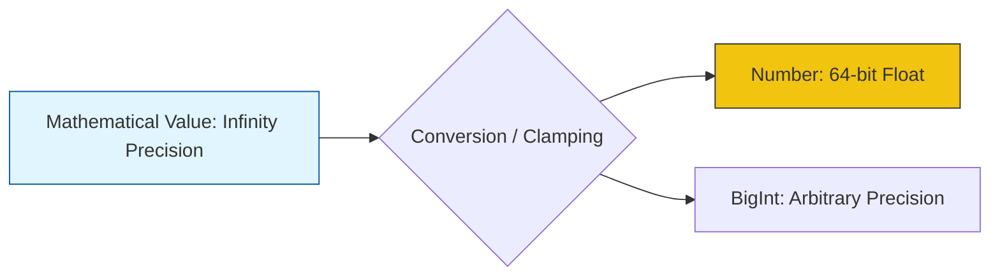

# CH-04: Spec Mathematics and Shorthands

> **"Kalkulator presisi Hub. `Spec Mathematics and Shorthands` membedah sistem matematika abstrak dan cara cepat spesifikasi untuk menjelaskan operasi yang rumit."**

**Source Hub**: 
- [ECMA-262: Mathematical Operations](https://tc39.es/ecma262/#sec-mathematical-operations)

---

## 1. Konsep & Esensi

**Definisi Arsitek**:
Matematika di spesifikasi berbeda dengan matematika di kode. Spesifikasi menggunakan **Mathematical Values** (MV)—angka ideal dengan presisi tak terbatas. Hub lalu mendefinisikan aturan bagaimana MV ini "dibulatkan" (clamped) menjadi tipe data Hub seperti `Number` (64-bit float) atau `BigInt`. **Shorthands** adalah frasa singkat (misal: "Return ?") yang merangkum banyak langkah logika sekaligus.

**Model Mental**:
- **Mathematical Value**: Angka murni di dalam pikiran (Sempurna).
- **JavaScript Number**: Angka yang dicetak di atas kertas (Terbatas oleh lebar kertas).
- **Shorthand**: Seperti singkatan "dll." yang membuat kalimat lebih pendek tapi semua orang tahu maksudnya.

---

## 2. Visualisasi Sistem: Mathematical Precision

---

## 3. Mekanisme & Hubungan

### Operasi Logika (Clause 5.2.5 - 6.1)
1. **The Abstract Equality Short**: Memahami bagaimana `==` dirangkum dalam satu tabel kebenaran raksasa.
2. **Integer Indexed Expressions**: Aturan matematika untuk menghitung indeks array tanpa risiko angka pecahan.
3. **The `X + Y` Notation**: Di spesifikasi, penjumlahan dilakukan pada Mathematical Values terlebih dahulu sebelum sirkuit dikonversi ke tipe data bahasa.

### Arsitek Mindset: Precision Awareness
- Selalu ingat bahwa apa yang Anda lihat di layar (misal: `0.1 + 0.2`) adalah hasil dari pembulatan (clamping) MV ke dalam format IEEE 754. Dengan memahami matematika spesifikasi, Anda akan berhenti menyalahkan "bug" bahasa dan mulai memahami batasan fisik sirkuit Hub.

---

## 4. Lab Praktis
Buka file `examples/spec_math_precision_lab.js` untuk menguji perbedaan antara nilai matematika murni dan hasil evaluasi yang dibatasi oleh presisi 64-bit di Hub.

---
*Status: [status.md](../../../../../status.md)*
