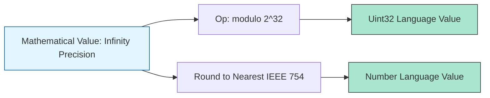
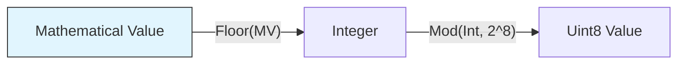

# CH-04: Spec Mathematics and Shorthands

> **"Presisi Matematika dan Notasi Ekspres. `Spec Mathematics and Shorthands` membedah sistem kalkulasi absolut Hub dan singkatan-singkatan yang mempercepat penulisan standar."**

**Source Hub**: 
- [ECMA-262: Mathematical Operations](https://tc39.es/ecma262/#sec-mathematical-operations)

---

## 1. Konsep & Esensi

**Definisi Arsitek**:
Hub membedakan antara **Mathematical Value (MV)**—angka ideal teoritis dengan presisi tak terbatas—dan tipe data bahasa seperti `Number` atau `BigInt`. Algoritma Hub bekerja menggunakan MV terlebih dahulu, lalu menerapkan aturan pembulatan atau pemotongan (clamping) untuk menghasilkan nilai bahasa yang sesuai dengan memori fisik.

**Model Mental**:
- **MV**: Angka murni di alam semesta logika (Tanpa batas).
- **Number**: Angka yang Anda muat ke dalam tangki bensin 64-bit (Sangat terbatas dan memiliki sisa error).

---

## 2. Visualisasi Sistem: Mathematical Clamping

### Mathematical Clamping Logic

---

## 3. Mekanisme & Hubungan

### Operasi dan Singkatan (Clause 5.2.5 - 6.1)
1. **Mathematical Operations**: Penjumlahan (`+`), pengurangan (`-`), dan eksponensial dilakukan pada Mathematical Values. Spesifikasi mendefinisikan secara eksplisit bagaimana menangani overflow.
2. **Floating Point Arithmetic**: Memahami bahwa `(0.1 + 0.2)` di MV menghasilkan `0.3` absolut, tapi di tipe `Number` ia dipotong sesuai standar IEEE 754, menghasilkan `0.30000000000000004`.
3. **Spec Shorthands**: Frasa seperti "Return ?" atau "Perform !" bukan hanya kata-kata, tapi merangkum seluruh rantaian logika `ReturnIfAbrupt`.

### Arsitek Mindset: Precision Safety
- Jangan pernah mengasumsikan presisi "tak terbatas" di sirkuit uang atau data sensitif. Gunakan `BigInt` jika Anda memproses Mathematical Values yang sangat besar (integer), dan selalau sadari batasan presisi 64-bit saat melakukan kalkulasi pecahan di Hub.

---

## 4. Lab Praktis
Buka file `examples/spec_math_audit.js` untuk membedah perbedaan antara hasil matematika ideal vs hasil evaluasi engine pada operasi floating point yang kritis.

---
*Status: [status.md](../../../../../status.md)*
