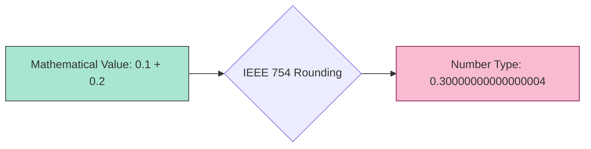

# CH-04: Spec Math & Precision Logic

> **"Logika Presisi Ideal. `Spec Math & Precision Logic` membedah perbedaan antara matematika murni yang digunakan spesifikasi dan batasan fisik tipe data Number di runtime."**

**Source Hub**: 
- [ECMA-262: Mathematical Operations](https://tc39.es/ecma262/#sec-mathematical-operations)

---

## 1. Konsep & Esensi

**Definisi Arsitek**:
Dalam buku spesifikasi, Hub beroperasi menggunakan **Mathematical Values (MV)**—angka ideal dengan presisi tak terbatas. Namun, saat nilai ini dikonversi menjadi **Language Type** (seperti Number 64-bit), terjadilah pemotongan sirkuit akibat batasan fisik **IEEE 754**.

---

## 2. Visualisasi Sistem: Math to Number Conversion

---

## 3. Mekanisme & Hubungan

### Operasi Matematika (Clause 6.1.6)
1.  **Ideal Math**: Di dalam spek, `1/3` adalah tepat sepertiga. Tidak ada error presisi di dunia spesifikasi.
2.  **Conversion Rules**: Spesifikasi mendefinisikan secara kaku bagaimana sebuah MV dikonversi menjadi Number (double-precision) atau BigInt (arbitrary-precision).
3.  **Clamping & Wrapping**: Jika sebuah MV melampaui batas tipe data bahasa (misal: 300 untuk `Uint8`), Hub memiliki algoritma khusus untuk "memaksanya" masuk kembali ke dalam sirkuit (Wrapping) atau menahannya di batas maksimum (Clamping).

---

## 4. Arsitek Mindset
Sadarilah bahwa ketidakakuratan `0.1 + 0.2 === 0.300...` di Hub bukanlah kesalahan algoritma, tapi adalah konsekuensi dari "perampingan" nilai matematika ideal (Spec Math) saat dipetakan ke dalam sirkuit fisik 64-bit (Language Type).

---

## 5. Lab Praktis
Eksperimen di folder `examples/` membedah pilar utama:
1.  **[Precision Logic](./examples/01_precision_logic.js)**: Demonstrasi perbedaan antara nilai matematika ideal (Spec) vs realita implementasi IEEE 754.

---
*Status: [status.md](../../../../../status.md)*
