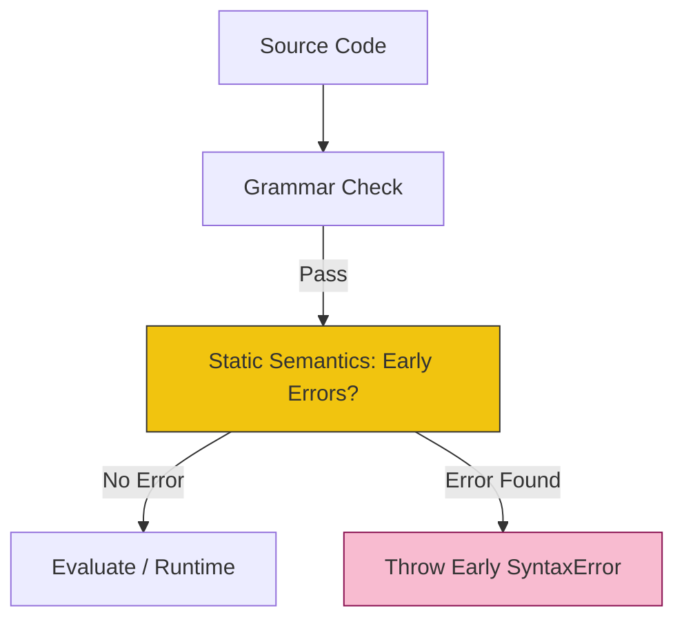

# CH-01: Static Semantics and Early Errors

> **"Satpam intelektual Hub. `Static Semantics and Early Errors` adalah lapisan pertahanan kedua yang memeriksa integritas logika kode sebelum kepingan energi (runtime) dilepaskan."**

**Source Hub**: 
- [ECMA-262: Static Semantic Rules](https://tc39.es/ecma262/#sec-static-semantic-rules)

---

## 1. Konsep & Esensi

**Definisi Arsitek**:
Setelah kode lolos dari pemeriksaan Grammar (Struktur), Hub akan menjalankan **Static Semantic Rules**. Jika aturan ini dilanggar, Hub akan melempar **Early SyntaxError**. Berbeda dengan runtime error yang terjadi saat kode berjalan, Early Error menghentikan seluruh proses Agent Hub sebelum eksekusi dimulai.

**Model Mental**:
- **Grammar Check**: Memeriksa apakah kalimat Anda memiliki subjek dan predikat (Struktur).
- **Static Semantics**: Memeriksa apakah kalimat Anda masuk akal ("Meja memakan manusia" secara struktur benar, tapi secara semantik salah). Hub melakukan ini untuk memastikan tidak ada deklarasi ganda atau penggunaan kata kunci di tempat terlarang.

---

## 2. Visualisasi Sistem: Validation Gate

---

## 3. Mekanisme & Hubungan

### Filter Keamanan (Clause 5.1.1)
1. **Early Errors**: Aturan yang dicetak tebal dalam spesifikasi dengan awalan "It is a Syntax Error if...". Contoh: mendeklarasikan dua variabel `let` dengan nama yang sama di scope yang sama.
2. **Static Scope Rules**: Hub memetakan hubungan antara variabel dan scope secara statis agar engine bisa mengoptimalkan akses memori.
3. **Forbidden Extensions**: Hub melarang penggunaan fitur non-standar tertentu dalam mode ketat (Strict Mode) melalui filter semantik ini.

### Arsitek Mindset: Fast Failure
- Berterima kasihlah pada **Static Semantics**. Mekanisme ini memastikan bahwa kesalahan fatal dideteksi sedini mungkin. Arsitektur yang baik adalah arsitektur yang "Gagal dengan Cepat" (Fail Fast) di tahap validasi, daripada meledak di tengah proses transaksi data yang krusial bagi pengguna.

---

## 4. Lab Praktis
Buka file `examples/early_error_lab.js` untuk melihat bagaimana Hub menolak eksekusi file tersebut secara total hanya karena ada satu kesalahan deklarasi statis di akhir file.

---
*Status: [status.md](../../../../../status.md)*
