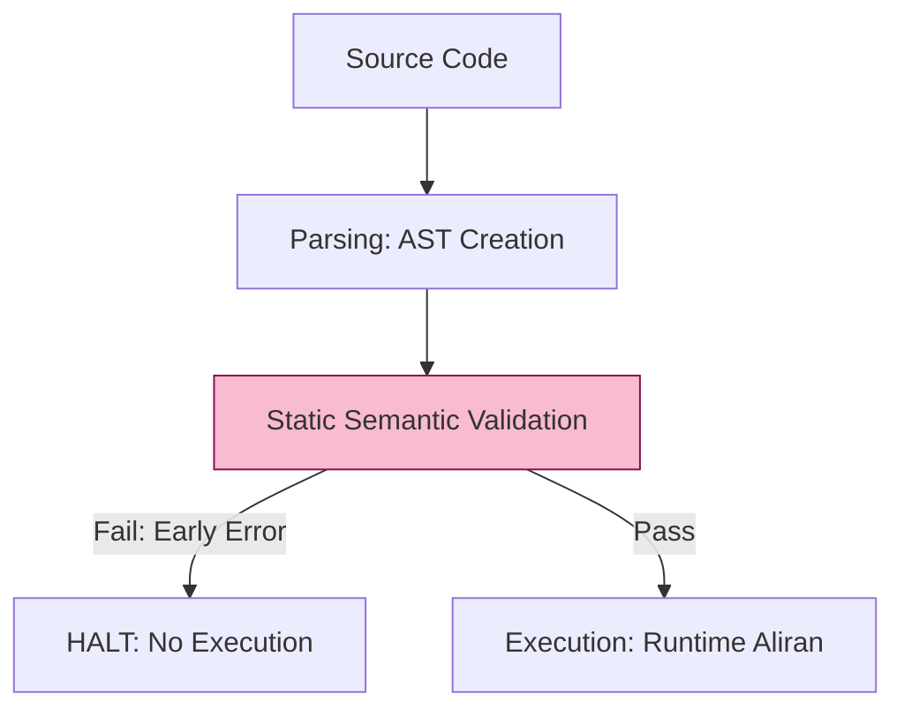

# CH-01: Early Errors & Static Constraints

> **"Sensor Sintaksis. `Early Errors & Static Constraints` membedah sistem pertahanan Hub yang mendeteksi kesalahan sirkuit sebelum sepeser pun energi eksekusi dialirkan."**

**Source Hub**: 
- [ECMA-262: Static Semantic Rules](https://tc39.es/ecma262/#sec-static-semantic-rules)

---

## 1. Konsep & Esensi

**Definisi Arsitek**:
**Static Semantics** adalah sekumpulan aturan yang divalidasi oleh Hub tepat setelah proses parsing selesai, namun **sebelum** kode dijalankan. Jika aturan ini dilanggar (misal: penggunaan deklarasi ganda di level yang sama), Hub akan melempar **Early Error** (biasanya berupa SyntaxError) dan membatalkan seluruh proses eksekusi script.

---

## 2. Visualisasi Sistem: Static Validation Gap

---

## 3. Mekanisme & Hubungan

### Infrastruktur Keamanan (Clause 13)
1.  **Strict Mode Constraints**: Banyak aturan semantik statis yang hanya muncul saat `use strict` diaktifkan, seperti larangan nama parameter fungsi yang duplikat.
2.  **Lexical Scope Validation**: Hub secara statis mengecek apakah ada variabel `const` atau `let` yang dideklarasikan ulang di dalam blok yang sama. Deteksi ini terjadi secara instan tanpa perlu menunggu kode tersebut dieksekusi.
3.  **Cross-Rack Linking**: Pemahaman semantik statis di **SR-01** adalah landasan bagi **RAK-03** (Fitur Modern), karena fitur seperti `private fields` (#) sangat bergantung pada validasi statis untuk mencegah akses ilegal.

---

## 4. Arsitek Mindset
Rancanglah sirkuit aplikasi Anda agar "gagal lebih awal" (*fail fast*). Semantik statis adalah sahabat arsitek karena ia menangkap bug struktural secara otomatis sebelum bug tersebut masuk ke dalam runtime yang kompleks dan sulit didebug.

---

## 5. Lab Praktis
Eksperimen di folder `examples/` membedah pilar utama:
1.  **[Early Errors](./examples/01_early_errors.js)**: Demonstrasi bagaimana Hub mendeteksi kesalahan sintaksis dan redeklarasi variabel secara statis.

---
*Status: [status.md](../../../../../status.md)*
